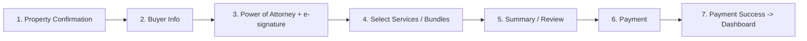

> **Not stale, and it cannot go stale.** Dated 2026-05-23. This file records what the source material
> said, the letter of engagement, the client requirements document, the legal comments and the original
> proposal, on the day it was read. A record of inputs does not expire the way an audit of the code
> does, so nothing here is corrected. Two parts are worth reading with a date in mind: §9, the codebase
> inventory, describes the code as it stood in May, and §11's conflicts were resolved in
> [`02_MASTER_PRD.md`](02_MASTER_PRD.md) §9. Current state: [`../HANDOVER.md`](../HANDOVER.md). Current
> gaps: [`../MVP_OUTSTANDING_BACKLOG.md`](../MVP_OUTSTANDING_BACKLOG.md).
> (Banner added 2026-08-02 by story DOCS-4.)

# 01 — Source Synthesis

**SafeBuyRealties · Strategic Definition Engagement · Phase 1 of 5**
Prepared for: Goodness Olajide (Corne Labs, Technical Lead)
Prepared by: Senior Product Architect (strategic definition — no application code)
Date: 2026-05-23

---

## 0. Purpose & how to read this document

This is the **foundation document** for the SafeBuyRealties strategic definition. It does one
job: ingest every source of truth about the product and consolidate it into a single navigable
inventory, ending in a **deduplicated master feature inventory** that the Master PRD (Phase 2)
will build on.

This document **describes what the sources say** — it does not yet define the product (Phase 2),
audit the build in depth (Phase 3), size gaps (Phase 4), or recommend scope (Phase 5). Where
sources disagree, the conflict is **flagged here and resolved later** (§11 lists them; Phase 2
resolves them).

Reading order: §1 explains the sources; §2–§9 are per-source extractions; **§10 is the payload**
(master feature inventory); §11 lists conflicts to resolve.

---

## 1. Document map & method

### 1.1 Sources ingested

| #   | Source                          | Type                       | Location                                        | Role in project                                                        |
| --- | ------------------------------- | -------------------------- | ----------------------------------------------- | ---------------------------------------------------------------------- |
| 1   | Static HTML demo                | 66-page static site        | `safebuyrealtiesng-html/` repo                  | Client's own vision of look/feel/scope — strongest experiential signal |
| 2   | Letter of Engagement (LOE)      | PDF, 4 pp                  | `docs/inputs/LOE.pdf`                           | Commercially binding scope (₦1.5M MVP)                                 |
| 3   | Client Requirements Document    | DOCX                       | `docs/inputs/client-requirements.docx`          | Most comprehensive functional description                              |
| 4   | Client Legal Comments           | DOCX                       | `docs/inputs/client-legal-comments.docx`        | Non-functional / contractual / compliance expectations                 |
| 5   | Professional Ecosystem Document | DOCX                       | `docs/inputs/professional-ecosystem.docx`       | Defines the Nigerian professional network                              |
| 6   | Corne Labs Proposal             | PDF, 9 pp                  | `docs/inputs/corne-labs-proposal.pdf`           | Agency's original product articulation (₦2.8M)                         |
| 7   | Existing PRD                    | Markdown                   | `docs/inputs/existing-prd.md` (= `docs/PRD.md`) | Thin starting-point PRD                                                |
| 8   | Active codebase — frontend      | React 19 / Vite / TanStack | `safebuyrealties/src/`                          | Current build (FE)                                                     |
| 9   | Active codebase — backend       | NestJS / Prisma / Postgres | `safebuyrealties/backend/`                      | Current build (BE)                                                     |
| —   | Prior tech audit                | Markdown                   | `docs/TECH_AUDIT.md` (dated 2026-05-02)         | **Stale** earlier audit; partially superseded by current code          |

### 1.2 Method

- **PDFs** (LOE, proposal) read directly.
- **DOCX** files (requirements, legal comments, ecosystem) have no native reader in the
  environment; LibreOffice headless conversion failed, so text was extracted by parsing
  `word/document.xml` with a small Python script (paragraph/list/heading-aware). Full body text
  was recovered for all three.
- **Both repositories** were walked exhaustively by read-only subagents (static demo: page-by-
  page; active FE: route-by-route with mock-vs-real verdicts; active BE: module/endpoint/schema).
- §9 (codebase) is intentionally **high-level here** — the detailed honest audit is Phase 3.

### 1.3 One-line product definition (synthesized)

> A controlled (non-peer-to-peer) Nigerian real-estate marketplace where **only internally
> verified listings** can be transacted, buyers pay for **structured due-diligence services**
> separately from property purchase, legal instruments (notably a **digital Power of Attorney**)
> are executed with cryptographic integrity, **escrow** protects funds, and every action is
> **status-governed and audited** — operated by internal staff and a network of registered
> property professionals.

---

## 2. Static HTML demo inventory (`safebuyrealtiesng-html`)

The demo is the client's **experiential benchmark**. It is a static site (HTML/CSS/JS) with a
`properties.json` data file, hardcoded demo users, `localStorage`-based session + flow state,
and references to a Supabase client. **66 HTML pages.** Design language: emerald green
(`#00d4a1` / `#10b981`), gold premium accents, Poppins (body) + Playfair Display (headings),
rounded cards, dark and light themes, Chart.js dashboards, WhatsApp float, AOS animations.

### 2.1 Roles represented (7)

`Super Admin`, `Admin`, `Staff`, `Professional` (Lawyer/Surveyor/Valuer/Engineer/etc.),
`Agent/Broker`, `Seller`, `Buyer`. Login auto-routes by role; demo password for all: `SafeBuy2025.`

### 2.2 Public / marketing (root + `pages/public/`)

| Page                                                                                                                                | Purpose                       | Notable content                                                                                                                                                                                                                        |
| ----------------------------------------------------------------------------------------------------------------------------------- | ----------------------------- | -------------------------------------------------------------------------------------------------------------------------------------------------------------------------------------------------------------------------------------- |
| `index.html`                                                                                                                        | Landing                       | Hero **services carousel of 15 services** (below); 6 role cards (Buyers, Sellers, Professionals, Agents, Developers, Diaspora); featured properties from `properties.json`; search bar (location/type/budget/keyword); "why choose us" |
| `public/listings.html`                                                                                                              | All verified listings         | Responsive grid, status badges, "View Details", WhatsApp float                                                                                                                                                                         |
| `public/properties/property-detail.html`                                                                                            | Dynamic property page (by id) | Hero image slider, specs grid (beds/baths/land area/build type), features, gallery, lawyer/surveyor verification info, CTAs: **Start Due Diligence**, Inquire, Schedule Inspection; seeds `localStorage 'safebuy_flow'`                |
| `public/properties/property-bourdillon-ikoyi.html`                                                                                  | Hardcoded sample              | 5-Bed Oceanview, Ikoyi, ₦850,000,000, Verified                                                                                                                                                                                         |
| `public/about.html`, `services.html`, `how-it-works.html`, `contact.html`, `blog.html`, `guides.html`, `privacy.html`, `terms.html` | Marketing / legal / content   | About (mission, stats, team), Services (15 services w/ pricing & "Inquire"), How-it-works (process), Contact (form + Lagos/Abuja offices), Blog/Guides (content hubs), Privacy/Terms (legal text)                                      |

**The 15 verification services** (home carousel + services page): Property Due Diligence;
Land Search/Charting (Govt Acquisition Check); C of O Confirmation; Title Verification &
Authentication; Survey Plan Verification/Revalidation; Excision Status Confirmation; Gazette
Verification; Deed of Assignment Preparation & Registration; Governor's Consent Processing;
Title Perfection & Regularization; Property Documentation Audit; Property Valuation; Property
Risk & Investment Assessment; Property Ownership Dispute Advisory; Transaction Monitoring &
Escrow Support.

### 2.3 Authentication (`pages/auth/`)

- `login.html` — role-aware login (dark UI, emerald accent), hardcoded demo users per role,
  redirects to role dashboard.
- `register.html` — value-prop panel + form; **role selector (Buyer, Seller, Agent,
  Professional)**; Google sign-up (demo); terms/privacy; password ≥ 6 chars.

### 2.4 Buyer due-diligence / service flow (`pages/service-flow/`) — the centerpiece

A **7-step, state-aware, resumable wizard** (progress bar; state in `localStorage`; "Save &
decide later" on most steps). This is the single most important demonstration of intended product
behavior.

| Step | File                         | What it does                                                                                                                                                                                   |
| ---- | ---------------------------- | ---------------------------------------------------------------------------------------------------------------------------------------------------------------------------------------------- |
| 1    | `property-confirmation.html` | Confirm selected property; trust badges (Lawyer Verified, Escrow Protected, Physical Inspection, Diaspora Friendly)                                                                            |
| 2    | `buyer-info.html`            | Capture full name, email, phone, country, state/region                                                                                                                                         |
| 3    | `poa.html`                   | **Power of Attorney execution** (detail below)                                                                                                                                                 |
| 4    | `services.html`              | Choose **3 bundles** — Standard ₦2,950,000 / Premium ₦4,200,000 (most popular) / Elite ₦5,850,000 — or **à-la-carte** services; live subtotal + 7.5% VAT + total; escrow/no-hidden-fees badges |
| 5    | `summary.html`               | Review order; "nothing charged yet"                                                                                                                                                            |
| 6    | `payment.html`               | 4 methods (Card, Bank Transfer, USSD, Online platform = Paystack/Flutterwave); order summary w/ VAT; **100% Escrow Protected** seal; price-locked badge; "Save & pay later"                    |
| 7    | `payment-success.html`       | Transaction id, next steps, "Access Dashboard" — creates buyer dashboard access                                                                                                                |

Supporting flow pages: `onboarding.html`, `setup.html`, `buyer-account-access.html`,
`poa-terms.html`, `checkout.html`, plus a `due-flow.html` entry.

**Power of Attorney step (`poa.html`) — detail.** This is the legal heart of the product:

- Property summary + appointed **law firm** branding (Goldrush Partners LP; partner Femi
  Adisa-Isikalu; license `SBR-LAW-GLDR25A7-001`; "LASREA-licensed, 1,200+ titles perfected").
- **Legal framing** citing Evidence Act 2011 & Electronic Transactions Act 2023: must be in
  writing, signed by buyer w/ legal capacity, witnessed by advocate/commissioner for oaths,
  e-signature binding, **register at Land Registry within 60 days**.
- **Full Irrevocable PoA text**: appoints the firm to process & perfect title, obtain Governor's
  Consent, pay fees, prepare documents, receive C of O; irrevocable until completion; revocation
  clause; indemnity clause (2-yr survival); "modus operandi" seller-buyer template w/ 10%
  brokerage commission.
- **4 mandatory consent checkboxes** (age/sound mind; witnessing; 60-day registration;
  irrevocability) + **digital signature** (draw on canvas OR type name; clear; emerald strokes).
- Trust badges: Lawyer-Drafted, E-Signature Valid, Secure & Confidential.

> Note: the demo's PoA captures consent + signature visually. The **Client Requirements doc**
> (§4) extends this to **hash generation / document fingerprinting / QR code / PDF generation /
> secure archival** as part of the legal audit trail. The demo shows the _experience_; the
> requirements doc specifies the _integrity mechanics_.

### 2.5 Role dashboards (`pages/dashboard/`)

| Page                                                                 | Role         | Sidebar / content highlights                                                                                                                                                                                                              |
| -------------------------------------------------------------------- | ------------ | ----------------------------------------------------------------------------------------------------------------------------------------------------------------------------------------------------------------------------------------- |
| `buyer-dashboard.html`                                               | Buyer        | Sidebar: Dashboard, My Properties, Service Status, Due Diligence Reports, Messages/Chat, Payments & Escrow, Documents, Profile. Stats (monitored, active DD cases, completed, pending payments); charts; recent cases table; theme toggle |
| `seller-dashboard.html`                                              | Seller       | Sidebar: Dashboard, My Properties, Buyer Inquiries, Offers Received, Transactions, Documents. Stats (listed, inquiries, offers, sold); charts; properties table (views/inquiries)                                                         |
| `professional-dashboard.html`                                        | Professional | Sidebar: Dashboard, My Assignments, Inspections, DD Reports, Earnings, Profile & Certification. Stats (active assignments, completed reports, pending review, earnings); assignment table; earnings trend                                 |
| `overview.html`, `properties.html`, `chat.html`, `case-details.html` | Role-aware   | Generic overview, property management, **chat/messaging UI**, single case/transaction detail (timeline, documents, status)                                                                                                                |

### 2.6 Admin / staff / super-admin (`pages/admin/` — 31 pages)

Menus are generated by role from `menu.config.js` (Super Admin / Admin / Staff variants),
backed by `permissions.config.js` (RBAC permissions like `VIEW_PROPERTIES`, `VERIFY_PROPERTIES`,
`MANAGE_USERS`, `MANAGE_CASES`, `VIEW_FINANCE`, `MANAGE_PAYMENTS`, `VIEW_REPORTS`,
`MANAGE_SETTINGS`).

**Property registry & status views:** `property-management.html` (full CRUD: title, subtitle,
location, location-code, price, status, description, hero-slider + gallery image uploads),
`verified-properties.html`, `under-review.html` (status dropdowns + toast, "More Info Needed"),
`under-offer.html`, `sold.html`, `rejected.html`, `more-info.html`, `property-submission.html`
(approval queue), `preview.html`, `my-listing.html` (agent view).

**Transactions / finance:** `property-payment.html` (payments table, refund/adjust, **escrow
release controls**), `ongoing-deal.html` (active deals, % progress, risk flags),
`case-details.html` (case timeline, assignments, documents, payment tracking, notes/status
history).

**People management:** `buyer-mgt.html`, `seller-mgt.html`, `seller-onboarding.html`
(KYC/docs/commission), `agents-brokers.html` (licenses, commission, performance),
`professional.html` (directory, certification, assignments, earnings, ratings),
`staff-management.html`, `admin.html` (admins + 2FA), `user-profile.html` (own profile, 2FA,
sessions), `permission.html` (**RBAC role/permission matrix**, create custom role).

**Operations:** `service-management.html` (15-service catalog, pricing, bundles, assign to
professionals), `schedule-inspection.html` (property + inspector + date/time + type),
`Property-inquiry.html` (inquiries), `chat.html` (internal messaging/support).

**Analytics / governance:** `analytics.html`, `business-analytics.html` (revenue, funnel,
conversion, avg transaction value, professional earnings distribution), `super-dashboard.html`
(executive KPIs, red-flag alerts, system health), `settings.html` (commission rates, service
pricing, **7.5% VAT**, **escrow settings**, notification templates, email config, payment
gateway settings, document requirements), `dashboard.html` (role-aware metrics).

### 2.7 Data / status concepts surfaced by the demo

- **Property statuses:** Pending Review · Verified · Under Offer · Sold · Needs More Info · Rejected.
- **Transaction states (implied):** Inquiry → Confirmation → Due Diligence In Progress → PoA
  Signed → Payment Pending → Payment Received (escrow) → Services Completed → Title Perfected →
  Complete → Closed/Archived.
- **Escrow:** funds held until service completion/approval; refund-on-withdrawal implied.
- **Professional assignment:** specific lawyer/surveyor/valuer attached to a property/case.

---

## 3. Letter of Engagement (LOE) extraction — the binding scope

**Parties:** Corne Technology and Innovation Labs Ltd ("Corne Labs") ↔ SafeBuy Realties (rep.
Mr. Oluwafemi Adisa-Isikalu). Dated **Apr 17, 2026**. Signed by Goodness Olajide (Founder &
Technical Lead). **Objective: a fully functional MVP** supporting real-world usage across all
primary user types.

### 3.1 Scope of work (role-based)

| Role                                                                 | LOE capabilities                                                                                                                                              |
| -------------------------------------------------------------------- | ------------------------------------------------------------------------------------------------------------------------------------------------------------- |
| **Buyers**                                                           | Register/manage account; browse **verified** listings; initiate transactions; **pay for due diligence and property acquisition**; track progress on dashboard |
| **Sellers**                                                          | Register/manage; submit listings; upload documentation; track verification status                                                                             |
| **Property Professionals** (inspectors, surveyors, legal reps, etc.) | Register/maintain profile; be assigned to verification/DD; upload reports/supporting docs; update task status                                                 |
| **Internal Staff**                                                   | Review submitted documents; manage verification workflows; approve/reject listings; update property status                                                    |
| **Administrators**                                                   | Full control: user management; property approval & status control; platform monitoring/oversight                                                              |

### 3.2 Core platform features (LOE)

Property listing & submission · document upload & verification workflow · role-based dashboards
· **payment integration (Paystack/Flutterwave)** · transaction tracking.

### 3.3 Escrow & transaction flow (LOE)

Buyers initiate payments → property verification completed → transactions tracked → **payment
release dependent on completion of required conditions**. (Escrow described as conditional fund
release; no escrow-config UI specified.)

> **LOE scope boundary (verbatim intent):** _"Any features not explicitly stated above are
> considered out of scope for this phase."_

### 3.4 Milestones, commercials, terms

- **Timeline:** 6–8 weeks. **Milestone 1 (2–4 wks):** auth, role dashboards (Buyer/Seller/
  Professional/Staff/Admin), listing submission/display, document upload & verification workflow,
  core transaction flow.
- **Fees:** **₦1,500,000** total — ₦500k deposit / ₦600k at Milestone 1 / ₦400k at final.
- **Hosting:** ₦120k/yr (client's cost); Corne Labs does setup/deploy.
- **Deliverables:** functional MVP, source-code access, basic documentation, deployment setup,
  handover session.
- **Support/maintenance:** **60 days** free post-launch; then **Basic plan ₦75,000/month** (4
  hrs support).
- **IP:** client owns custom code on full payment; Corne Labs retains pre-existing
  tools/frameworks and may reuse general concepts/patterns/modules.
- Limitation of liability capped at total fee; either party may terminate w/ written notice.

---

## 4. Client Requirements Document extraction — the comprehensive functional spec

This is the **richest functional source**. It explicitly positions SafeBuyRealties as a
**transaction-risk mitigation and governance platform**, not a listing website. Guiding
principle: **"verification before commitment."**

### 4.1 Business objectives

Protect buyers from fraud; create a structured, **auditable** verification process before
purchase; standardize property-status visibility; **separate due-diligence payments from
property-purchase payments**; ensure regulatory alignment & legal traceability; scale for
professionals/sellers/staff.

### 4.2 Platform positioning (hard rules)

- **Not peer-to-peer.** Listings subject to internal verification.
- **Transaction progression governed by system-enforced statuses.**
- Legal documentation & consent **digitally executed and archived.**
- **Every action time-stamped and auditable.**

### 4.3 Actors (5 named)

Buyers; Sellers; Property Professionals (agents, lawyers, surveyors, inspectors);
Internal Staff; Administrators. _(Note: the per-role sidebars in §4.9 expand this to 7 by
splitting out Agents/Brokers and Super Admin.)_

### 4.4 Seller flow

Registration + **identity verification** → dashboard access → property submission (location,
pricing, ownership docs, supporting records) → auto-status **Pending Review** (visible but
clearly marked unverified) → internal verification (authenticity, ownership validity, regulatory
compliance, possible external registry checks/legal review/field inspections) → outcome
**Verified / Pending Review (more info) / Rejected**. Only verified properties allow buyer
engagement beyond viewing.

### 4.5 Property status governance (centralized, system-controlled)

Statuses: **Pending Review · Verified · Under Offer · Sold.** Reflected uniformly across
listings, dashboards, notifications, transactional flows. Transitions only via authorized
actions (data integrity; anti-manipulation).

### 4.6 Buyer flow & due-diligence purchase flow

- Buyer registers → personalized dashboard; browse/filter by **verified**; **save/like**;
  notifications on status change. **Buyers cannot pay on unverified properties.**
- **Defining feature: due-diligence payments are separate from property-purchase payments.**
- Selecting a verified property enters a **structured multi-step purchase flow** — _all steps
  sequential, state-aware, and resumable_:
  1. Property confirmation → 2. **Execution of Power of Attorney** → 3. Buyer information capture
     → 4. Selection of due-diligence services/bundles → 5. Transaction summary & review →
  2. **Payment for due-diligence services only** → 7. Redirection to dashboard.

### 4.7 Power of Attorney execution (integrity mechanics)

Digital PoA authorizing SafeBuyRealties to conduct verification on the buyer's behalf, with:
**explicit consent acknowledgment · digital signature capture · hash generation & document
fingerprinting · QR code creation for validation · PDF generation · secure storage.** Retained
as part of the **legal audit trail** for compliance & dispute resolution.

### 4.8 Payment confirmation, inspection, internal ops, governance

- On successful DD payment: property → **Under Offer**; buyer notified; seller notified (DD in
  progress); **internal staff alerted to start verification**; property effectively **reserved**
  (prevents double-selling/parallel engagement).
- **Inspection scheduling:** time-slot availability, no double-booking, logged outcomes linked
  to the property record.
- **Internal staff dashboards:** manage verification queues; track DD tasks; update statuses;
  upload findings; communicate with buyers/sellers. **All staff actions logged.**
- **Buyer dashboard:** properties under DD; completed purchases; saved/liked; notifications;
  account settings; real-time status.
- **Administrators:** user/staff management; **status overrides where legally justified**;
  system config/feature control; **audit-log access**; compliance monitoring. Admin actions
  restricted & fully auditable.

### 4.9 Per-role sidebar specifications (verbatim from the doc — defines 7 role surfaces)

> These sidebars are the most concrete statement of intended breadth. They expand the 5 named
> actors to **7 navigable role surfaces** (Super Admin + Admin + Staff + Professionals +
> Agents/Brokers + Sellers + Buyers).

- **Super Admin:** Dashboard (global), Messages/Internal Chat, Business Analytics, Analytics &
  Reports, **People Management** (Admins, Staff, Agents/Brokers, Professionals, Buyers, Sellers),
  **Role & Permission Control**, Property Registry (+ premium filtering), Verified / Under Offer
  / Recently Sold / Needs More Info / Rejected, Transaction Oversight, Properties Payment, Due
  Diligence & Services, **Escrow & Payment Configuration**, Case Details & Assignments,
  Compliance & Audit Logs, **KYC/AML Rules**, Marketplace Settings, Content & Pages, System
  Integrations (Maps, Payments, Docs), Notifications & Broadcasts, Support & Escalations,
  Billing/Revenue/Subscriptions, Reports & Exports, System Settings, Profile.
- **Admin:** as above but limited Transaction Oversight & System Settings; adds Seller/Buyer/
  Agent/Professional management, KYC & Compliance Review, Document Verification, Support Tickets,
  Staff Coordination.
- **Staff:** Dashboard, Messages, Case Details & Assignments, Property Listings (view/verify),
  status views, Document Review, KYC Processing, Support Tickets, **Task Queue**, Notifications,
  Reports (limited), Help/SOPs, Profile.
- **Professionals:** My Dashboard, Messages/Case Chat, **Assigned Cases**, Property Documents,
  **Inspection/DD Tasks**, **Appointments & Schedule**, **Reports Upload**, Notifications,
  **Earnings/Fees**, Profile & Credentials, Support.
- **Agents/Brokers:** Dashboard, **Submit Listing**, My Listings (w/ performance), status views,
  Messages, **Leads/Prospects**, **Offers & Negotiations**, Client Messages, Viewing
  Appointments, **Sales Performance**, **Commission & Earnings**, Profile.
- **Sellers:** Dashboard, Messages, Submit Listing, My Listings (w/ performance), status views,
  Property Inquiries, Offers & Negotiations, Documents Upload, **Payments & Payouts**, Support,
  Profile.
- **Buyers:** Dashboard, Messages, **Ongoing Deals (Due Diligence)**, Browse (saved searches),
  **Saved/Liked**, **My Offers**, Bought Properties, Relisted Properties, status views, Documents
  & Reports, Payments, Properties Payment, Due Diligence & Services, Escrow & Payment
  Configuration, Support, Profile.

### 4.10 Stated current state & future enhancements (per the client doc)

The doc claims core flows, standardized DD flow, status governance, **live digital PoA**, and
all four dashboards are _operational_ (this is the **client's** assertion — Phase 3 will test it
against the actual repo). Listed enhancements: **escrow-based property-purchase payments**,
expanded regulatory reporting, **advanced fraud detection**, **mobile app**, marketplace
expansion for verified professionals.

---

## 5. Client Legal Comments extraction — non-functional / contractual / compliance

A lawyer's markup of the LOE. Product-relevant signals (the rest is contract negotiation):

- **NDPR compliance & data ownership** are explicit expectations: _"No data ownership / NDPR
  compliance warranties (you will hold personal and transaction data)"_ — flagged as a critical
  gap. Data ownership must remain SafeBuy's.
- **Security obligation:** _"No security audit or penetration-testing obligation before go-live"_
  — flagged as critical for a **payment + document-verification real-estate platform**. Wants a
  security audit prior to final delivery.
- **Escrow legal safeguards:** _"No escrow-specific legal safeguards or fund-release conditions
  clearly defined."_ Fund-release conditions must be explicit.
- **Payment regulatory compliance:** Paystack/Flutterwave named but no responsibility for CBN/AML
  compliance — wants this addressed.
- **Governing law:** add Nigeria / Lagos State jurisdiction + mediation clause.
- **Warranties:** platform free of material defects, fit for secure real-estate transactions,
  developed in **material compliance with Nigerian law incl. NDPR and payment regulations.**
- **IP re-use:** tighten — no reuse of proprietary transaction workflows / escrow logic /
  verification processes for 24 months; non-confidential features reusable only w/ written
  permission.
- **Handover:** on completion, hand over **all front-end & back-end login details and code**,
  retain no access; train SafeBuy staff; remain available for technical issues.
- **Maintenance:** make the ₦75k/month optional/terminable (commercial, not product).

> Net product implication: **NDPR, document integrity/audit trail, explicit escrow fund-release
> rules, and a pre-launch security review are non-negotiable quality bars**, not nice-to-haves.

---

## 6. Professional Ecosystem extraction — the Nigerian professional network

Frames the real-world professional roles SafeBuyRealties orchestrates, with **registration
bodies** (legal protection/recourse). Divided into **Purchase phase** and **Build phase**, each
with **Formal (licensed)** and **Informal/support** categories.

### 6.1 Purchase phase — formal (essential)

| Professional                   | Body                                                  | Core function                                                                                                                                                                                                               |
| ------------------------------ | ----------------------------------------------------- | --------------------------------------------------------------------------------------------------------------------------------------------------------------------------------------------------------------------------- |
| Real Estate Lawyer / Solicitor | NBA                                                   | Full due diligence; title search; verify C of O, Governor's Consent, Deed of Assignment, Survey Plan; check litigation/acquisition/encumbrances; draft Agreement of Sale & Deed of Assignment; witness. **Non-negotiable.** |
| Registered Land Surveyor       | SURCON (Surveyors Council of Nigeria)                 | Verify beacons/boundaries on-site; confirm survey-plan coordinates; topography/soil/flood risk; fresh survey                                                                                                                |
| Estate Valuer / Appraiser      | NIESV                                                 | Independent valuation (avoid overpaying; mortgage/bank)                                                                                                                                                                     |
| Government Registry Officials  | Land Registry / Surveyor-General / Planning Authority | Official searches (accessed via lawyer/surveyor, not hired directly)                                                                                                                                                        |

Purchase-phase **informal/support:** Real Estate Agent/Broker/Marketer (introductions,
negotiation — many unlicensed); Community Leaders/Family Heads/Baale (customary-land consent);
Local Informants/Neighbours (on-ground intel: disputes, flooding, **omo-onile**). Key tip:
**never pay without lawyer + surveyor clearance.**

### 6.2 Build phase — formal (required by law)

Registered Architect (**ARCON**); Town/Urban Planner (**TOPREC/NITP**); Structural/Civil
Engineer (**COREN**); Quantity Surveyor (**NIQS**); Registered Builder (**CORBON**); Mechanical
& Electrical Engineers (COREN); Project Manager/Clerk of Works; Geotechnical Engineer (COREN —
critical for swampy/waterlogged land). Approvals via state authority (e.g. **LASPPPA/LASBCA** in
Lagos): survey plan, architectural/structural drawings, soil test, EIA; **all drawings carry
registered seals**; stage-by-stage inspection; Certificate of Completion & Fitness for
Habitation.

Build-phase **informal/support:** Main Contractor; artisans (masons, carpenters, plumbers,
electricians, tilers, painters, iron benders, roofers); material sellers (sand, rods, paint,
tiles, sanitary, doors/windows, POP, electrical, plumbing); casual labour; site security.

### 6.3 Context (the fraud problem this product attacks)

Land Use Act complexity; title-fraud, double-selling, document falsification; government
acquisition risk; family disputes; **omo-onile** (land-grabbing groups extorting illegal fees).
Red flags: too-good-to-be-true deals, unlicensed agents, pressure to pay omo-onile directly.

> Product implication: the **Professional** role is not monolithic — it spans **7+ formal types
> across 2 phases**, each tied to a **regulator and a credential**, and the existing schema's
> `ProfessionalType` enum (Lawyer/Surveyor/Valuer/Architect/Engineer/Builder/QuantitySurveyor)
> maps to the purchase- and build-phase formal professionals (missing Town Planner/Geotechnical/
> M&E split). Verification steps (Legal/Survey/Valuation/etc.) map to these professionals.

---

## 7. Corne Labs Proposal extraction — original articulation

Dated **Mar 22, 2026** (predates the LOE). Largely aligned with the LOE but **broader in
ambition and different commercially.**

### 7.1 Features articulated

- **Advanced listings** (images, location, description, **title documentation**, pricing);
  pending-verification by default; only verified become buyable.
- **Robust search & filtering** (location, price, type, size, bedrooms, amenities) + **saved
  searches**.
- **Role-based dashboards** — Buyers (browse verified, track DD, initiate payments, **communicate
  with sellers**, **schedule inspections**); Sellers (submit, upload docs, track, communicate);
  Professionals (inspections, verification, legal-doc validation); Internal Staff (workflows,
  validation, approvals, oversight); Admins (user mgmt, **system config**, monitoring,
  **reporting/analytics**).
- **Secure payment & escrow:** buyers pay for DD → verification → **purchase funds held in
  escrow** → released to seller only when all conditions satisfied. Via Paystack/Flutterwave.

### 7.2 Stack & integrations

Frontend **React.js**; backend Node/Express or Python/Django; relational DB (PostgreSQL/MySQL);
secure cloud, SSL, automated backups, monitoring. Integrations: payment gateways, **email**,
**SMS**, **Maps (Google Maps)**, escrow services.

### 7.3 Future enhancements (proposal)

**Mobile field app** (inspectors/surveyors/agents: capture photos on site, upload reports,
update status, submit location); **AI** (automated document verification, **fraud-detection
indicators**, smart recommendations, market pricing); marketplace expansion (**map-based
discovery**, comparison tools, premium-listing subscriptions, seller analytics).

### 7.4 Commercials (DIFFER from the signed LOE — see §11)

- **Total ₦2,800,000** (LOE: ₦1.5M) — 50% kickoff / ₦700k Milestone 1 / ₦700k final.
- **30 days** post-launch support (LOE: 60 days).
- Maintenance tiers **₦100k / ₦300k / ₦600k** (LOE: Basic ₦75k).
- Deliverables add a **user guide for administrators** and **training session**.

> The **LOE supersedes the proposal commercially** (signed, later-dated, explicit scope
> boundary). The proposal remains useful for **product articulation and the future-phase menu**.

---

## 8. Existing PRD extraction (`docs/inputs/existing-prd.md` = `docs/PRD.md`)

A thin, early PRD. Roles: Buyer, Seller, **Property Professionals (7 types: Lawyer, Surveyor,
Valuer, Architect, Engineer, Builder, Quantity Surveyor)**, Internal Staff, Admin. Professional
capabilities include **flag risks (dispute, flood risk, omo-onile)** and mark verification stage
complete. Flows: Listing (Seller → Upload → Pending → Assigned → Verified → Live); Due Diligence
(buyer initiates → system assigns professionals → reports → decision → payment); Transaction
(pay → funds tracked → conditions satisfied → release). Modules: Auth & RBAC, Listings,
**Verification Engine** (Legal/Survey/Valuation/Risk flags), Task Assignment, Payments
(Paystack/Flutterwave), Dashboard, **Notifications (email/SMS later; in-app)**. Lists core API
endpoints and high-level DB tables (Users, Listings, Documents, VerificationSteps, Tasks,
Transactions). **Design system: Deep Classy Green `#0B6B3A`, white/light-gray, clean/enterprise.**

> The existing PRD is the **closest match to what the backend actually implements** (its API list
> and DB tables align with the NestJS modules) — but it omits PoA, escrow config, messaging,
> agents/brokers, super-admin, document integrity, and audit logging that the demo + requirements
> doc demand. It is a floor, not the ceiling.

---

## 9. Active codebase inventory (high-level — detailed audit deferred to Phase 3)

> Scope here is _inventory only_ so the master feature list can mark what exists. Honest
> implemented/partial/broken/mock assessment, quality and security analysis are **Phase 3**.
> Note: the active build is **more advanced than the stale `docs/TECH_AUDIT.md` (2026-05-02)**
> implies (e.g. transactions/payments are now wired; auth uses HttpOnly cookies).

### 9.1 Stack

- **Frontend:** React 19, Vite, TanStack Router (file-based) + Query, Tailwind v4, Radix/shadcn
  UI (~53 components), `lucide-react`, `sonner` toasts. Brand green via OKLCH (~`#0B6B3A`).
- **Backend:** NestJS, Prisma, PostgreSQL 16 (docker-compose), Passport-JWT, bcryptjs, Helmet,
  Multer. Global `/api/v1` prefix, `{data, meta}` response envelope, global validation + exception
  filter. Auth via **HttpOnly `sbr_session` cookie** (7-day JWT) + Bearer fallback.

### 9.2 Frontend routes (18) and wiring

Public: `/` (static landing), `/login`, `/register` (Buyer/Seller only), `/listings/$id` (live).
Buyer: `/dashboard/buyer`, `/buyer/listings`, `/buyer/transactions` (payments + escrow timeline).
Seller: `/dashboard/seller`, `/seller/listings`, `/seller/documents` (upload + submit-for-review).
Professional: `/dashboard/professional`, `/professional/tasks`, `/professional/tasks/$id` (report

- evidence upload). Staff: `/dashboard/staff`, `/staff/workflow`, `/staff/submissions`. Admin:
  `/dashboard/admin`, `/admin/users`, `/admin/listings`.

* **Wired & working (~14 routes):** auth, buyer browse/transaction/payment (mock-capable), seller
  listing create + document upload + submit, professional task detail (w/ evidence), admin
  user-role & listing-status management.
* **4 known runtime bugs (FE):** `/staff/workflow` uses undefined `patchStepMutation` and missing
  `useCreateTaskMutation`; `/staff/submissions` calls undefined `approve()`; professional dashboard
  - tasks use unimplemented `useTaskKpiCounts`. These break staff approve/reject and professional
    stat cards.
* **Absent from FE:** Power of Attorney, messaging/chat, notifications UI, saved/liked properties,
  advanced search/map, analytics dashboards, schedule-inspection (button disabled), agent/broker &
  super-admin surfaces.

### 9.3 Backend modules (10) & endpoints

`auth` (register/login/logout/me), `users` (list/get/patch, role mgmt), `listings` (CRUD +
status transitions + role-based visibility + **auto verification-template on PENDING_REVIEW**),
`documents` (upload to **local disk**, list; 15MB limit; **no MIME validation**), `verification`
(assign / list / patch step; 8-step template), `tasks` (create by staff / list-mine / patch),
`payments` (Paystack initiate + **mock mode** + webhook w/ HMAC-SHA512 signature; couples to
transactions), `transactions` (buyer create / list-mine / get; INITIATED→IN_PROGRESS→COMPLETED),
`health`. **No tests. No notifications, messaging, escrow logic, audit log, PoA/hashing/QR,
password reset, refresh tokens, rate limiting.**

### 9.4 Prisma schema — enums & models

- **Enums:** `UserRole` {BUYER, SELLER, PROFESSIONAL, STAFF, ADMIN}; `ProfessionalType` {LAWYER,
  SURVEYOR, VALUER, ARCHITECT, ENGINEER, BUILDER, QUANTITY_SURVEYOR}; `ListingStatus` {DRAFT,
  PENDING_REVIEW, ASSIGNED, IN_VERIFICATION, VERIFIED, LIVE, REJECTED, ARCHIVED};
  `VerificationStepType` {SUBMISSION, DOCUMENT_REVIEW, FIELD_VERIFICATION, LEGAL, SURVEY,
  VALUATION, RISK_REVIEW, FINAL_APPROVAL}; `VerificationStepStatus` {PENDING, IN_PROGRESS,
  COMPLETED, BLOCKED}; `TaskStatus` {PENDING, IN_PROGRESS, COMPLETED}; `PaymentStatus` {PENDING,
  PROCESSING, SUCCEEDED, FAILED, REFUNDED}; `TransactionStatus` {INITIATED, IN_PROGRESS,
  COMPLETED}.
- **Models:** User, Listing, Document, VerificationStep, Task (has unused `documentId`),
  Transaction, Payment. Seed creates all roles + 18 listings across every status + tasks/
  transactions/payments.

> **Schema vs sources gap (preview):** No `SUPER_ADMIN` or `AGENT/BROKER` role; no escrow/PoA/
> notification/message/audit/inspection/savedProperty entities; listing status enum
> (`ASSIGNED/IN_VERIFICATION/LIVE`) differs from the client's vocabulary (`Under Offer/Sold`);
> no Service/Bundle catalog entity for the 15 DD services. Detailed in Phases 3–4.

---

## 10. Consolidated master feature inventory (the spine for Phase 2)

Deduplicated capabilities across **all** sources. Columns: feature; serving role(s); which
sources assert it (**LOE** / **REQ** = client requirements / **DEMO** / **PROP** = proposal /
**PRD** = existing PRD / **LEGAL** = legal comments / **ECO** = ecosystem); and presence in the
current build (✅ built · 🟡 partial · 🔴 absent · — n/a) as a _coarse_ flag only (Phase 3
verifies). "In LOE?" marks whether it falls inside the signed scope.

### 10.1 Accounts, identity & access

| Feature                                   | Roles                              | Sources                   | Build                  | In LOE? |
| ----------------------------------------- | ---------------------------------- | ------------------------- | ---------------------- | ------- |
| Register / login / session                | All                                | LOE, REQ, DEMO, PROP, PRD | ✅                     | Yes     |
| Self-registration role selection          | Buyer, Seller, Agent, Professional | DEMO                      | 🟡 (Buyer/Seller only) | Partial |
| Identity verification / KYC at onboarding | Seller, Buyer                      | REQ, DEMO                 | 🔴                     | Implied |
| KYC/AML rules & review                    | Staff, Admin, SuperAdmin           | REQ, DEMO                 | 🔴                     | No      |
| Role-based access control (RBAC)          | All                                | LOE, REQ, DEMO, PRD       | ✅                     | Yes     |
| Custom roles & permission matrix          | SuperAdmin                         | REQ, DEMO                 | 🔴                     | No      |
| Profile management / credentials          | All; Professional (credentials)    | REQ, DEMO                 | 🟡                     | Yes     |
| 2FA / session management                  | Admin, SuperAdmin                  | DEMO                      | 🔴                     | No      |
| Password reset / email verification       | All                                | (gap)                     | 🔴                     | Implied |

### 10.2 Roles present across sources

| Role                               | LOE                 | REQ | DEMO | PRD | Build |
| ---------------------------------- | ------------------- | --- | ---- | --- | ----- |
| Buyer                              | ✅                  | ✅  | ✅   | ✅  | ✅    |
| Seller                             | ✅                  | ✅  | ✅   | ✅  | ✅    |
| Property Professional (multi-type) | ✅                  | ✅  | ✅   | ✅  | ✅    |
| Internal Staff                     | ✅                  | ✅  | ✅   | ✅  | ✅    |
| Administrator                      | ✅                  | ✅  | ✅   | ✅  | ✅    |
| **Agent / Broker**                 | (subsumed)          | ✅  | ✅   | 🔴  | 🔴    |
| **Super Admin**                    | (subsumed in Admin) | ✅  | ✅   | 🔴  | 🔴    |

### 10.3 Listings & property registry

| Feature                                                                              | Roles                    | Sources                   | Build                  | In LOE?     |
| ------------------------------------------------------------------------------------ | ------------------------ | ------------------------- | ---------------------- | ----------- |
| Submit listing (location, price, docs, images)                                       | Seller, Agent, Staff     | LOE, REQ, DEMO, PROP, PRD | ✅ (no image mgmt)     | Yes         |
| Listing media (hero slider + gallery)                                                | Seller, Staff            | DEMO                      | 🔴                     | Partial     |
| Property detail page (specs, features, gallery)                                      | Public, Buyer            | DEMO, PROP                | 🟡 (no specs fields)   | Yes         |
| Status governance: Pending Review/Verified/Under Offer/Sold/Needs More Info/Rejected | System                   | REQ, DEMO                 | 🟡 (different enum)    | Yes         |
| Status views/registry filtering by status                                            | Staff, Admin, SuperAdmin | REQ, DEMO                 | 🟡                     | Yes         |
| Search & filtering (location/price/type/size/beds/amenities)                         | Buyer, Public            | PROP, DEMO                | 🟡 (client-side basic) | No (LOE)    |
| Saved searches                                                                       | Buyer                    | PROP, REQ                 | 🔴                     | No          |
| Saved / liked properties                                                             | Buyer                    | REQ, DEMO                 | 🔴                     | No          |
| Map-based discovery                                                                  | Buyer                    | PROP                      | 🔴                     | No (future) |

### 10.4 Verification & professional workflow

| Feature                                                                            | Roles                      | Sources             | Build                          | In LOE? |
| ---------------------------------------------------------------------------------- | -------------------------- | ------------------- | ------------------------------ | ------- |
| Document upload for listing                                                        | Seller, Staff              | LOE, REQ, DEMO, PRD | ✅ (local disk, no MIME check) | Yes     |
| Internal verification workflow (multi-step)                                        | Staff, Professional        | LOE, REQ, DEMO, PRD | ✅ (8-step template)           | Yes     |
| Assign professionals to steps/cases                                                | Staff                      | LOE, REQ, DEMO, PRD | 🟡 (FE assign buggy)           | Yes     |
| Professional report upload + risk flags                                            | Professional               | REQ, DEMO, PRD, ECO | 🟡 (task evidence only)        | Yes     |
| Approve / reject / request-more-info                                               | Staff, Admin               | LOE, REQ, DEMO      | 🟡 (FE approve broken)         | Yes     |
| Professional credentialing by regulator (NBA/SURCON/NIESV/ARCON/COREN/NIQS/CORBON) | Professional, Admin        | ECO, PRD            | 🔴                             | Implied |
| Inspection scheduling (slots, no double-book, logged)                              | Buyer, Professional, Staff | REQ, PROP, DEMO     | 🔴                             | Implied |
| Task queue & status updates                                                        | Staff, Professional        | REQ, PRD            | 🟡                             | Yes     |

### 10.5 Buyer transaction, PoA, payments & escrow

| Feature                                                                          | Roles                | Sources                     | Build                    | In LOE?       |
| -------------------------------------------------------------------------------- | -------------------- | --------------------------- | ------------------------ | ------------- |
| Multi-step DD purchase flow (resumable, state-aware)                             | Buyer                | REQ, DEMO                   | 🔴 (no wizard)           | Partial       |
| **Power of Attorney execution (consent + e-signature)**                          | Buyer                | REQ, DEMO                   | 🔴                       | No            |
| **PoA integrity: hash/fingerprint, QR, PDF, archive**                            | Buyer, System        | REQ                         | 🔴                       | No            |
| DD service catalog (15 services) + bundles (Standard/Premium/Elite) + à-la-carte | Buyer, Admin         | DEMO                        | 🔴                       | No            |
| **Separation of DD payment vs property-purchase payment**                        | Buyer                | REQ, PROP                   | 🔴                       | Partial       |
| Payment integration (Paystack/Flutterwave)                                       | Buyer                | LOE, REQ, DEMO, PROP, PRD   | 🟡 (Paystack only, mock) | Yes           |
| VAT (7.5%) handling                                                              | System               | DEMO                        | 🔴                       | No            |
| Transaction tracking & lifecycle                                                 | Buyer, Staff         | LOE, REQ, DEMO, PRD         | ✅ (3-state)             | Yes           |
| Property reservation / anti-double-sell on Under Offer                           | System               | REQ                         | 🔴                       | Implied       |
| **Escrow: funds held; release on conditions met**                                | Buyer, Seller, Admin | LOE, REQ, DEMO, PROP, LEGAL | 🔴 (status only)         | Yes (concept) |
| **Escrow & payment configuration UI**                                            | Admin, SuperAdmin    | REQ, DEMO                   | 🔴                       | No            |
| Payouts to sellers; commission to agents                                         | Seller, Agent, Admin | REQ, DEMO                   | 🔴                       | No            |
| Refunds                                                                          | Buyer, Admin         | DEMO                        | 🔴 (enum only)           | No            |

### 10.6 Cross-cutting

| Feature                                           | Roles                            | Sources         | Build            | In LOE?                   |
| ------------------------------------------------- | -------------------------------- | --------------- | ---------------- | ------------------------- |
| In-app messaging / case chat                      | All                              | REQ, DEMO, PROP | 🔴               | No                        |
| Notifications (in-app)                            | All                              | REQ, DEMO, PRD  | 🟡 (toasts only) | No                        |
| Notifications (email / SMS)                       | All                              | PROP, PRD       | 🔴               | No                        |
| **Audit logs (time-stamped, every action)**       | Staff, Admin, SuperAdmin         | REQ, LEGAL      | 🔴               | Implied                   |
| Document management (per case/listing)            | All                              | REQ, DEMO       | 🟡               | Yes                       |
| Analytics & reporting / business analytics        | Admin, SuperAdmin, Seller, Agent | REQ, DEMO, PROP | 🔴               | No (Admin oversight only) |
| Marketplace/content/page management               | Admin, SuperAdmin                | REQ, DEMO       | 🔴               | No                        |
| System integrations config (maps, payments, docs) | SuperAdmin                       | REQ, DEMO       | 🔴               | No                        |
| Support tickets / escalations                     | Staff, Admin                     | REQ, DEMO       | 🔴               | No                        |
| Billing / revenue / subscriptions                 | SuperAdmin                       | REQ, DEMO       | 🔴               | No                        |

### 10.7 Non-functional & compliance

| Requirement                                    | Sources       | Build | In LOE?         |
| ---------------------------------------------- | ------------- | ----- | --------------- |
| Production-grade stability                     | LOE, LEGAL    | —     | Yes             |
| **NDPR compliance / data ownership**           | LEGAL, REQ    | 🔴    | Implied (LEGAL) |
| **Pre-launch security audit / pentest**        | LEGAL         | 🔴    | Requested       |
| Document integrity (hash/QR/audit trail)       | REQ           | 🔴    | No              |
| Escrow fund-release legal safeguards           | LEGAL, REQ    | 🔴    | Partial         |
| Payment regulatory compliance (CBN/AML)        | LEGAL         | 🔴    | No              |
| Mobile responsiveness                          | PROP, DEMO    | 🟡    | Implied         |
| Accessibility                                  | (quality bar) | 🟡    | Implied         |
| Secure cloud hosting, SSL, backups, monitoring | LOE, PROP     | 🟡    | Yes             |
| Full code + login handover, no retained access | LEGAL, LOE    | —     | Yes             |

### 10.8 Future / expansion (explicitly later-phase)

Mobile field app (PROP, REQ); AI document verification & fraud detection (PROP, REQ); smart
recommendations & market pricing (PROP); property comparison tools, premium-listing
subscriptions, seller analytics (PROP); build-phase professional orchestration & approvals
(ECO); regulatory reporting expansion (REQ).

---

## 11. Source conflicts & ambiguities (flagged here; resolved in Phase 2)

| #   | Conflict                                                                                                                                                                                                                            | Sources                    | Preliminary note (resolution = Phase 2)                                                                                    |
| --- | ----------------------------------------------------------------------------------------------------------------------------------------------------------------------------------------------------------------------------------- | -------------------------- | -------------------------------------------------------------------------------------------------------------------------- |
| C1  | **5 roles vs 7 roles.** LOE/PRD name 5; REQ sidebars + DEMO add **Agent/Broker** and **Super Admin**.                                                                                                                               | LOE/PRD vs REQ/DEMO        | Likely resolve to 7 (Agent/Broker and Super Admin are first-class in client's mental model); confirm with Goodness/client. |
| C2  | **Status vocabulary mismatch.** Client uses Pending Review/Verified/**Under Offer**/**Sold**/Needs More Info/Rejected; build uses DRAFT/PENDING_REVIEW/**ASSIGNED**/**IN_VERIFICATION**/VERIFIED/**LIVE**/REJECTED/ARCHIVED.        | REQ/DEMO vs build          | Map the two vocabularies; client-facing labels must match REQ; internal pipeline states can persist behind them.           |
| C3  | **Power of Attorney + document integrity** (hash/QR/PDF/archive) is central in REQ + DEMO but **absent from LOE scope** and from the build.                                                                                         | REQ/DEMO vs LOE/build      | Define fully in Master PRD; phasing decision (in/out of current delivery) is Goodness's call in Phase 5.                   |
| C4  | **Escrow depth.** LOE = conditional fund release (concept). REQ/DEMO = escrow + **escrow & payment configuration UI** + payouts/commission. PROP = funds held in escrow until conditions met. Build = status only, no escrow logic. | All                        | Define full escrow model; flag that true escrow may need a regulated provider / CBN considerations (per LEGAL).            |
| C5  | **DD-payment vs purchase-payment separation.** REQ makes this a _defining feature_; build conflates payment with a single transaction; demo shows DD-only payment in the wizard.                                                    | REQ vs build               | Master PRD must model two distinct payment intents.                                                                        |
| C6  | **Service catalog & pricing.** DEMO defines 15 services + 3 bundles + VAT; no source-of-truth pricing entity in build.                                                                                                              | DEMO vs build              | Define a Service/Bundle catalog entity; pricing is client config.                                                          |
| C7  | **Commercial figures.** LOE ₦1.5M / 60-day support / ₦75k maint. vs Proposal ₦2.8M / 30-day / ₦100k–₦600k.                                                                                                                          | LOE vs PROP                | **LOE governs** (signed, later). Non-product; recorded for completeness.                                                   |
| C8  | **Client's "current state" claims vs reality.** REQ asserts PoA is _live_ and all dashboards _operational_; the build has no PoA and several broken staff/professional flows.                                                       | REQ vs build               | Phase 3 audit will state the honest position; do not take REQ's status claims at face value.                               |
| C9  | **Professional taxonomy breadth.** ECO defines 7+ formal types across purchase **and** build phases (incl. Town Planner, Geotechnical, M&E); build enum omits some; build-phase orchestration is unscoped.                          | ECO/PRD vs build           | Master PRD defines the full taxonomy; build-phase professionals likely Future.                                             |
| C10 | **Notifications/messaging expectation.** REQ/DEMO/PROP assume in-app chat + notifications (and email/SMS); LOE omits; build has toasts only.                                                                                        | REQ/DEMO/PROP vs LOE/build | Define; phasing per Goodness.                                                                                              |
| C11 | **Inspection scheduling.** REQ specifies slot management + no double-booking + logging; demo has a schedule screen; build has none (disabled button).                                                                               | REQ/DEMO vs build          | Define; candidate for Launch-Ready or Phase 2.                                                                             |
| C12 | **Listing media.** DEMO expects rich hero/gallery image management; build stores documents but not listing images.                                                                                                                  | DEMO vs build              | Define media model.                                                                                                        |

---

## 12. Phase 1 conclusion & what's next

**State of understanding:** All seven documentary sources and both repositories have been
ingested. The product's intent is clear and consistent in spirit across REQ + DEMO (a
verification-governed, PoA-bearing, escrow-protected DD marketplace), while the **signed LOE is a
deliberately narrower MVP slice**, and the **current build implements the LOE-shaped core**
(auth, listings, verification workflow, tasks, transactions, Paystack) but **none of the
PoA/escrow-config/messaging/notification/audit/agent/super-admin breadth** the client's own demo
and requirements imply — plus a handful of concrete FE bugs.

**This document delivers:** a complete per-source extraction, a high-level codebase inventory, a
**deduplicated master feature inventory** (§10) tagged by source/role/build-status/LOE-scope, and
a **conflict register** (§11) to be resolved in the Master PRD.

**Next (Phase 2, on Goodness's approval):** `02_MASTER_PRD.md` — the complete north-star product
definition built on §10, with conflict resolutions (§11), end-to-end workflows + state diagrams,
a role/capability matrix, a conceptual data model, NFRs (NDPR/security/integrity/a11y), and
acceptance criteria. **No phasing yet** — the full product first; scoping decisions are Phase 5
and remain Goodness's call.

> **Stop point — awaiting Goodness's review of this Phase 1 synthesis before advancing to
> Phase 2.**
