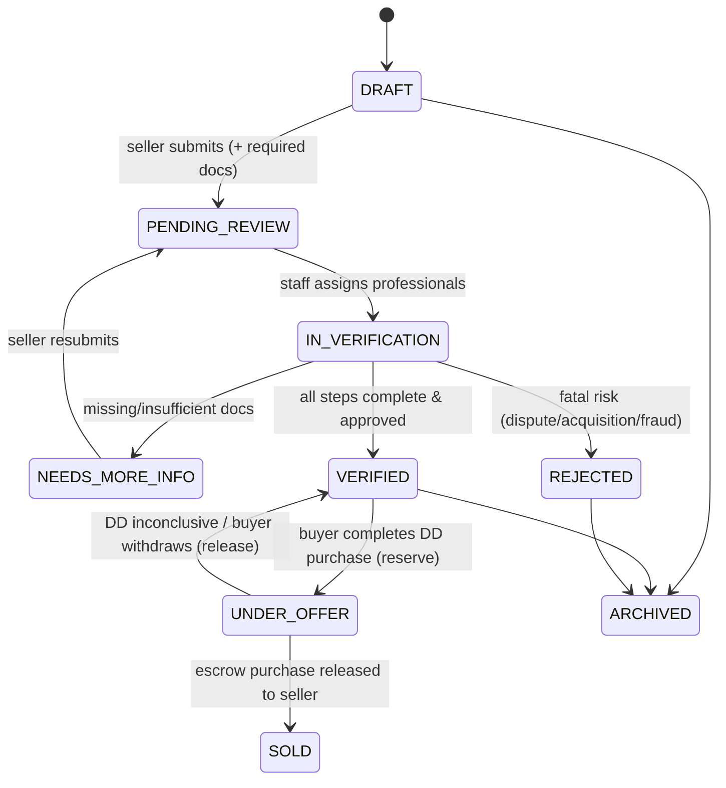
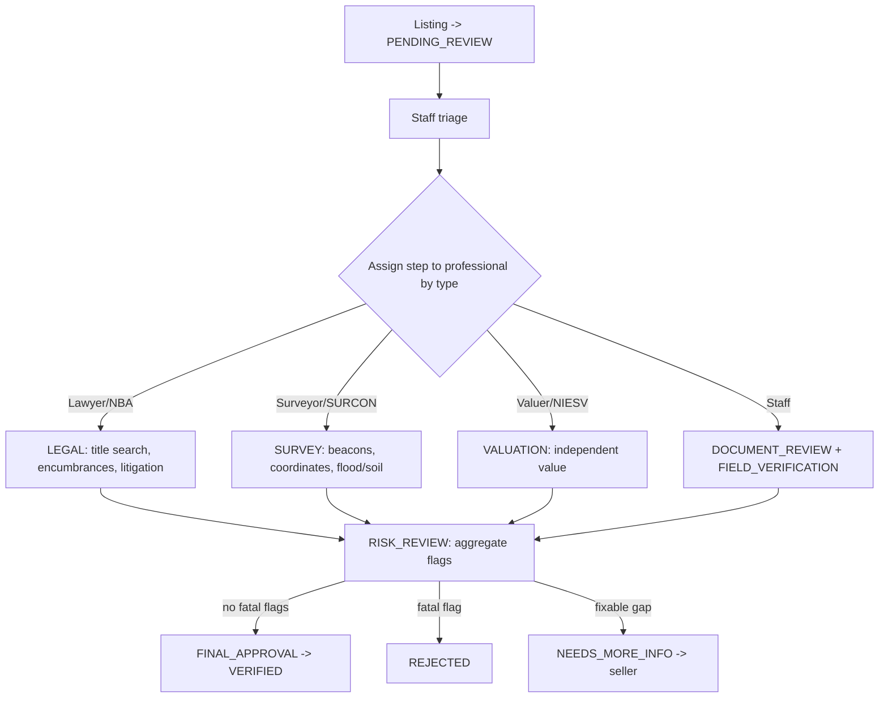
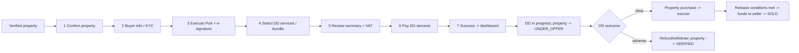
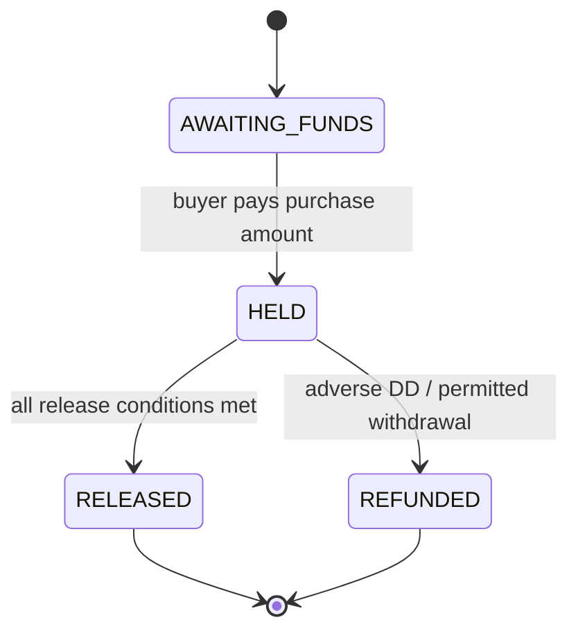
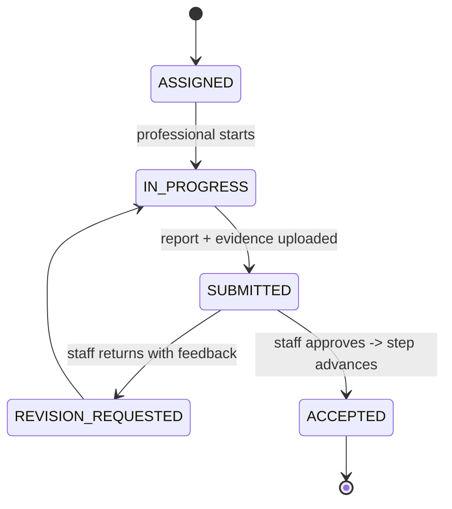
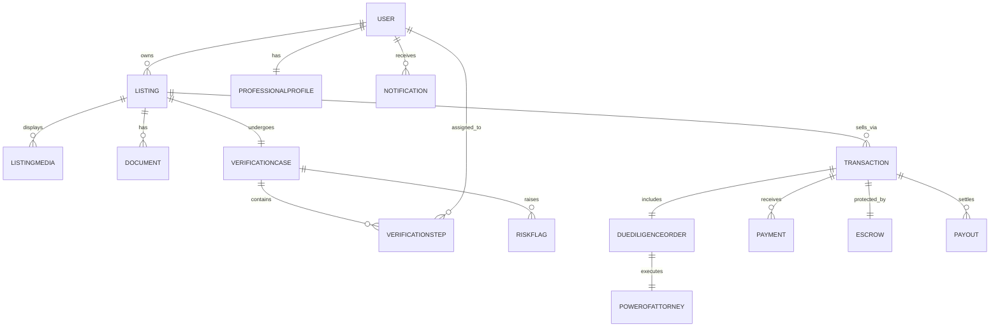

# 02 — Master Product Requirements Document (Master PRD)

**SafeBuyRealties · Strategic Definition Engagement · Phase 2 of 5**
Prepared for: Goodness Olajide (Corne Labs, Technical Lead)
Prepared by: Senior Product Architect
Date: 2026-05-23

---

## 0. How to read this document

This is the **north-star definition** of SafeBuyRealties — *what the product should be when
complete*, synthesized from all sources in `01_SOURCE_SYNTHESIS.md`. It is **deliberately not
constrained by the signed LOE**. Phasing (what ships now vs later) is **Phase 5** and remains
Goodness's call; this document gives him the complete map to decide against.

A new engineer should be able to read this document alone and understand the entire product.
Where the sources disagreed (conflicts C1–C12 in Phase 1), §9 states the resolution and
reasoning, and a small number of genuine **open decisions** are flagged for Goodness.

Conventions: **MUST / SHOULD / MAY** carry RFC-2119 weight. "DD" = due diligence. "PoA" = Power
of Attorney. Money is NGN. Acceptance criteria (§10) are testable and keyed to features.

---

## 1. Product vision & problem statement

### 1.1 Problem

In Nigeria, property buyers routinely lose large sums to **title fraud, document falsification,
double-selling, government-acquisition surprises, family/customary disputes, and "omo-onile"
extortion**. The land system (Land Use Act; C of O, Governor's Consent, Deed of Assignment,
Survey Plan) is complex, and verification is informal, opaque, and unauditable. Conventional
listing sites do nothing to mitigate this — they advertise properties without guaranteeing they
are real, unencumbered, or safely transferable.

### 1.2 Vision

> SafeBuyRealties is a **controlled, verification-governed real-estate transaction platform**
> where only internally verified listings can be transacted; buyers pay for **structured,
> professional due diligence** before committing purchase funds; legal consent (notably a
> **digital Power of Attorney**) is executed with **cryptographic integrity**; purchase funds
> are protected by **escrow**; and **every action is status-governed, time-stamped, and
> auditable** — operated by internal staff and a network of **registered professionals** (NBA
> lawyers, SURCON surveyors, NIESV valuers, and more).

### 1.3 Product principles (derived from the sources; binding)

1. **Verification before commitment.** No payment toward a property the platform has not
   verified; no purchase commitment before DD is complete.
2. **System-enforced status governance.** Property and transaction state changes happen only via
   authorized actions; status is reflected uniformly everywhere.
3. **Legal defensibility.** Consent and legal instruments are digitally executed, fingerprinted,
   and archived; every consequential action is logged immutably.
4. **Separation of money flows.** DD-service payments are distinct from property-purchase
   payments; purchase funds sit in escrow until release conditions are met.
5. **Trust by design.** NDPR compliance, security hardening, document integrity, and a calm,
   intentional UI that reassures users transacting in millions of naira.
6. **Not peer-to-peer.** The platform mediates; it is the trusted intermediary, not a classifieds
   board.

### 1.4 Success criteria (product-level)

- A buyer can go from discovery → verified-property confidence → DD purchase → PoA execution →
  escrow-protected purchase → title outcome, entirely on-platform, with full status visibility.
- A staff operator can run the verification pipeline end-to-end with assignment, professional
  reports, risk flags, approvals, and a complete audit trail.
- The platform can pass a pre-launch security review and demonstrate NDPR-aligned data handling.

---

## 2. Target users & personas

| Persona | Who | Goals | Pains the product solves |
|---------|-----|-------|--------------------------|
| **Tunde — first-time buyer (incl. diaspora)** | Professional buying land/home, possibly from abroad | Buy without being defrauded; verify remotely; clear status | Can't trust listings; can't physically inspect; fears omo-onile/double-sale |
| **Mrs. Okafor — seller / property owner** | Owner or authorized rep listing a property | List quickly; prove legitimacy; get paid safely | Buyers distrust unverified listings; slow, opaque sales |
| **Emeka — agent / broker** | Licensed/active intermediary | Submit listings, manage leads/offers, earn commission | No structured pipeline; commission disputes |
| **Barr. Fatima — property professional (lawyer/surveyor/valuer/…)** | Registered professional executing DD | Receive assignments, upload reports, get paid | Manual coordination; no central case/document hub |
| **John — internal staff** | SafeBuyRealties operations | Run verification queues, assign pros, approve/reject | No tooling; no audit trail; manual status juggling |
| **Aisha — administrator** | Governance & oversight | Manage users, override where justified, monitor compliance | No controlled overrides; no audit visibility |
| **Isoken — super administrator** | Executive / platform owner | Configure platform (escrow, pricing, integrations, RBAC), see business analytics | No global control plane |

---

## 3. User roles & capability matrix

### 3.1 Roles (7) — resolution of conflict C1

The product defines **seven role surfaces**. The client's requirements sidebars and the demo
treat **Agent/Broker** and **Super Admin** as first-class; the LOE/PRD subsumed them. The
north-star adopts all seven (Super Admin = a privileged Admin with platform configuration + RBAC;
Agent/Broker = a Seller-like role with leads/commission). Whether Agent/Broker and Super Admin
ship in the first delivery is a Phase 5 scoping call.

| Role | One-line definition |
|------|---------------------|
| Buyer | Discovers verified properties, runs DD, executes PoA, pays, transacts under escrow |
| Seller | Lists owned properties, uploads docs, tracks verification, receives payouts |
| Agent/Broker | Submits listings on behalf of owners; manages leads, offers, commission |
| Property Professional | Registered professional (multi-type) executing verification/DD tasks |
| Internal Staff | Operates verification pipeline; assigns pros; approves/rejects; supports users |
| Administrator | User/governance management; justified overrides; compliance monitoring |
| Super Administrator | Platform configuration (escrow, pricing, integrations), RBAC, business analytics |

### 3.2 Property Professional types — resolution of conflict C9

Two phases (per the ecosystem doc). Each type carries a **regulator + credential** captured at
onboarding and surfaced on the case/listing.

| Phase | Type | Regulator | Maps to verification step |
|-------|------|-----------|---------------------------|
| Purchase | Lawyer / Solicitor | NBA | LEGAL |
| Purchase | Land Surveyor | SURCON | SURVEY |
| Purchase | Estate Valuer | NIESV | VALUATION |
| Build* | Architect | ARCON | (build approvals) |
| Build* | Town/Urban Planner | TOPREC / NITP | (zoning/planning) |
| Build* | Civil/Structural Engineer | COREN | (structural) |
| Build* | Quantity Surveyor | NIQS | (cost/BoQ) |
| Build* | Builder | CORBON | (construction) |
| Build* | M&E Engineer | COREN | (services) |
| Build* | Geotechnical Engineer | COREN | (soil/foundation) |

*Build-phase professional orchestration is part of the complete vision but is a strong **Future**
candidate (Phase 5). Purchase-phase professionals (Lawyer/Surveyor/Valuer) are core.

### 3.3 Capability matrix (✓ = allowed; ✓* = own records only; — = no)

| Capability | Buyer | Seller | Agent | Professional | Staff | Admin | SuperAdmin |
|------------|:----:|:-----:|:----:|:-----------:|:----:|:----:|:---------:|
| Browse verified listings | ✓ | ✓ | ✓ | ✓ | ✓ | ✓ | ✓ |
| Save/like + saved searches | ✓ | — | — | — | — | — | — |
| Submit listing | — | ✓ | ✓ | — | ✓ | ✓ | ✓ |
| Upload listing documents | — | ✓* | ✓* | — | ✓ | ✓ | ✓ |
| Initiate DD purchase flow | ✓ | — | — | — | — | — | — |
| Execute Power of Attorney | ✓ | — | — | — | — | — | — |
| Pay DD services | ✓ | — | — | — | — | — | — |
| Make escrow-held purchase payment | ✓ | — | — | — | — | — | — |
| Receive payout / commission | — | ✓ | ✓ | ✓ (fees) | — | — | — |
| Schedule/conduct inspection | ✓ (request) | — | — | ✓ | ✓ | ✓ | ✓ |
| Be assigned verification/DD tasks | — | — | — | ✓ | — | — | — |
| Upload reports / raise risk flags | — | — | — | ✓ | ✓ | ✓ | ✓ |
| Assign professionals to steps | — | — | — | — | ✓ | ✓ | ✓ |
| Approve / reject / request-more-info | — | — | — | — | ✓ | ✓ | ✓ |
| Change property status (governed) | — | ✓* (limited) | ✓* (limited) | — | ✓ | ✓ | ✓ |
| Override status (justified, logged) | — | — | — | — | — | ✓ | ✓ |
| Manage users / roles | — | — | — | — | partial | ✓ | ✓ |
| RBAC / permission configuration | — | — | — | — | — | — | ✓ |
| Escrow / pricing / integration config | — | — | — | — | — | — | ✓ |
| View audit logs | — | — | — | — | ✓* | ✓ | ✓ |
| Business analytics / reports | — | ✓* (own) | ✓* (own) | ✓* (earnings) | limited | ✓ | ✓ |
| Messaging / case chat | ✓ | ✓ | ✓ | ✓ | ✓ | ✓ | ✓ |

---

## 4. Core workflows (end-to-end, with state transitions)

### 4.1 Property status model — resolution of conflict C2

The client's public vocabulary (Pending Review / Verified / Under Offer / Sold / Needs More Info
/ Rejected) is the **buyer-facing truth**. Internally the pipeline needs finer states. The
north-star defines one canonical lifecycle with a public-label mapping:

| Canonical state | Public label | Meaning |
|-----------------|--------------|---------|
| DRAFT | (not shown) | Seller/agent editing; not submitted |
| PENDING_REVIEW | Pending Review | Submitted; awaiting staff triage |
| IN_VERIFICATION | Pending Review | Assigned to professionals; checks underway |
| NEEDS_MORE_INFO | Needs More Info | Sent back to seller for clarification/docs |
| VERIFIED | Verified | Passed all checks; published & buyable |
| UNDER_OFFER | Under Offer | A buyer's DD purchase reserved it |
| SOLD | Sold | Purchase completed; ownership transferred |
| REJECTED | Rejected | Failed verification; not transactable |
| ARCHIVED | (not shown) | Withdrawn/expired |

### 4.2 Listing lifecycle workflow

Actors: Seller/Agent, Staff. 1) Seller/Agent creates DRAFT (title, location, price, type, specs,
media, ownership docs). 2) Uploads **required documents** (C of O / title deed, survey plan; plus
optional Deed of Assignment, Governor's Consent, tax receipt). 3) Submits → PENDING_REVIEW
(**hidden from buyers until VERIFIED** — Resolved Decision RD-2). 4) Staff
triage → assign verification steps → IN_VERIFICATION. 5) On approval → VERIFIED (published). 6)
NEEDS_MORE_INFO loops back to seller. **Buyers cannot pay on anything not VERIFIED.**

### 4.3 Verification workflow

Actors: Staff (orchestrate), Professionals (execute), System (governance). The platform creates a
**verification case** with ordered steps when a listing enters review:

`SUBMISSION → DOCUMENT_REVIEW → FIELD_VERIFICATION → LEGAL → SURVEY → VALUATION → RISK_REVIEW → FINAL_APPROVAL`

Each step has status {Pending, In Progress, Completed, Blocked, Rejected}, an optional assigned
professional, notes, **risk flags** (e.g. boundary dispute, government acquisition, flood risk,
omo-onile, encumbrance), and uploaded report(s).

Rules: a step's assigned professional or staff MUST update its status; completing a step is
logged; FINAL_APPROVAL is staff/admin-only; any RISK_REVIEW fatal flag blocks VERIFIED.

### 4.4 Buyer transaction lifecycle incl. Power of Attorney — resolution of C3 & C5

Two distinct money flows (C5): **DD-service payment** (paid up front to commission verification
work) and **property-purchase payment** (escrow-held, paid after DD outcome). The DD purchase
flow is the demo's 7-step **resumable, state-aware** wizard.

Transaction states: `INITIATED → DD_IN_PROGRESS → DD_COMPLETE → PURCHASE_PENDING →
PURCHASE_IN_ESCROW → COMPLETED` (plus `CANCELLED`, `REFUNDED`). On DD payment success: property →
UNDER_OFFER (**reserved**, preventing double-sell per the requirements doc); buyer, seller, and
staff notified.

**Power of Attorney execution (step 3) — full definition (C3):**
1. Display the irrevocable PoA instrument (firm appointment, scope: process & perfect title,
   Governor's Consent, fees, documents, receive C of O; revocation & indemnity clauses; Nigerian
   legal framing — Evidence Act 2011, Electronic Transactions Act 2023).
2. Capture **explicit consent** (mandatory acknowledgments: legal capacity; witnessing
   requirement; **Land Registry registration within 60 days**; irrevocability until completion).
3. Capture **digital signature** (draw-on-canvas or typed full name).
4. Generate the **PDF** of the executed instrument with buyer + firm details and timestamp.
5. Compute a **cryptographic hash / fingerprint** of the PDF (document integrity).
6. Generate a **QR code** encoding a validation URL/identifier for later authenticity checks.
7. **Securely store/archive** the PDF + hash + QR + signature metadata as part of the legal audit
   trail (immutable; retained for compliance and dispute resolution).

### 4.5 Escrow & fund-release workflow — resolution of conflict C4

Purchase funds are **held** after DD clears and released to the seller only when **all release
conditions** are satisfied. Conditions (configurable by Super Admin): DD complete & clear;
required legal instruments executed (incl. PoA); title/transfer steps confirmed; no unresolved
risk flags; buyer confirmation. On release → SOLD + seller **payout** (minus platform fee and any
agent **commission**). On adverse outcome/withdrawal within rules → **refund** + property →
VERIFIED.

> **Resolved Decision RD-1 (escrow mechanism).** Escrow is an **in-platform escrow ledger**:
> SafeBuyRealties maintains the logical held-balance and the release/refund logic, while money
> moves through **a single integrated payment gateway — Paystack OR Flutterwave** (one of the
> two) used for **both collection and disbursement** (the gateway's transfer/payout API funds
> seller payouts, agent commission, and buyer refunds). No third-party/regulated escrow provider
> is used. Implication: the platform must hold funds in a controlled settlement account, reconcile
> gateway settlement against the ledger, and apply release conditions before initiating payout —
> and must be mindful of CBN/AML expectations flagged in the legal-comments doc.

### 4.6 Document integrity workflow

Applies to the PoA (mandatory) and SHOULD apply to professional reports and issued certificates.
For any integrity-protected document: generate canonical PDF → compute hash/fingerprint → issue
QR/validation identifier → store immutably with metadata (author, timestamp, related case) →
expose a **public/authenticated validation endpoint** that confirms a presented document matches
the stored fingerprint. Any tampering breaks the hash and fails validation.

### 4.7 Professional task lifecycle

Staff create/assign tasks (or assign verification steps that generate tasks) to a professional of
the correct type, with title, type, due date, and required-evidence flag. Professional sees tasks
in their queue → works → uploads report/evidence → submits with checklist + notes + risk flags →
status COMPLETED. Staff review → accept (advance the related verification step) or **request
revision** (with feedback). Professional **earnings/fees** accrue per completed task.

### 4.8 Staff queue management workflow

A unified **work queue**: listings by pipeline state, verification steps awaiting assignment,
professional submissions awaiting review, buyer DD cases in progress, inspection requests, and
support tickets. Staff filter by status/type, assign, approve/reject/return, communicate, and act
— **every action time-stamped and logged** (requirements doc rule).

### 4.9 Admin & super-admin oversight workflow

Admin: manage users/staff/professionals/agents; **justified, logged status overrides**; KYC &
compliance review; document verification oversight; support escalations. Super Admin (adds):
RBAC/permission configuration; **escrow & payment configuration**; service catalog & pricing;
system integrations (maps, payments, document storage, email/SMS); marketplace/content settings;
notifications & broadcasts; billing/revenue; **full audit-log access**; business analytics.

---

## 5. Feature specifications by role

### 5.1 Buyer
Account + KYC; browse/search/filter **verified** listings; saved searches; save/like; property
detail (specs, media gallery, verification summary, professional attribution); **DD purchase
wizard** (§4.4) incl. **PoA execution** (§4.4); DD service selection (bundles + à-la-carte, §6.x);
**DD payment** and **escrow purchase payment**; transaction tracking with real-time status &
escrow timeline; documents & reports (incl. validatable PoA); inspection requests; messaging;
notifications; payments history; profile.

### 5.2 Seller
Account + identity verification; submit/edit listings (specs, media, ownership docs); track
verification status & respond to **Needs More Info**; view inquiries & offers; transactions;
**payouts**; messaging; notifications; profile. Limited governed status actions (submit/withdraw).

### 5.3 Agent / Broker
Seller capabilities (submit on behalf) plus **leads/prospects**, **offers & negotiations**,
viewing appointments, **sales performance**, **commission & earnings**, client messaging.

### 5.4 Property Professional
Profile with **regulator credential** (type, body, license no., expiry, verification status);
**assigned cases/tasks**; property documents (scoped to assignment); inspection/DD tasks;
**appointments & schedule**; **report upload + risk flags + checklist**; **earnings/fees**;
messaging; notifications.

### 5.5 Internal Staff
Verification **queue**; case details & assignments; assign professionals by type; document review;
KYC processing; approve/reject/request-more-info; governed status changes; inspection coordination;
support tickets; **task queue**; messaging; limited reports; **audit-aware** (all actions logged);
SOPs/help.

### 5.6 Administrator
All staff capabilities plus user/staff/agent/professional **management**; **justified status
overrides** (reason required, logged); KYC & compliance review; document verification oversight;
support escalations; notifications; **audit-log access**; reporting/analytics.

### 5.7 Super Administrator
All admin capabilities plus **RBAC/permission control**; **escrow & payment configuration**;
**service catalog & pricing** (15 services, 3 bundles, VAT); **system integrations**;
marketplace/content management; notifications & broadcasts; **billing/revenue/subscriptions**;
**business analytics**; global system settings.

---

## 6. Cross-cutting features

- **Search & filtering** (C-resolution: full): location, price range, type, size, bedrooms,
  amenities; **saved searches**; **map-based discovery** (Future). Public sees VERIFIED only.
- **Saved / liked properties** with status-change notifications.
- **DD service catalog** (C6): 15 services (Due Diligence, Land/Charting search, C of O, Title
  Verification, Survey Plan, Excision, Gazette, Deed of Assignment, Governor's Consent, Title
  Perfection, Documentation Audit, Valuation, Risk Assessment, Dispute Advisory, Transaction
  Monitoring/Escrow Support); **bundles** Standard/Premium/Elite; **à-la-carte**; configurable
  pricing + **7.5% VAT**. A first-class catalog entity (prices are Super-Admin config, not code).
- **Messaging / case chat** (C10): per-case threads among buyer, seller/agent, professional,
  staff; attachments; read receipts.
- **Notifications** (C10): in-app (status changes, assignments, payments, approvals, messages) +
  **email/SMS** channels; Super-Admin broadcast.
- **Document management**: per listing/case; categorized (title deed, survey plan, Governor's
  Consent, Deed of Assignment, reports, certificates, PoA); access-controlled by role/assignment;
  integrity-protected where applicable (§4.6). Listing **media** (hero + gallery) modeled
  separately from legal documents (C12).
- **Audit logs** (C-resolution: mandatory): immutable, time-stamped record of who did what, when,
  with before/after for governed changes (status transitions, overrides, assignments, payments,
  PoA execution). NDPR-relevant access also logged.
- **Inspection scheduling** (C11): time-slot availability, no double-booking, outcomes logged and
  linked to the property/case.

---

## 7. Conceptual data model (entities & relationships)

Implementation-agnostic. Entities the complete product needs (★ = exists in current build;
+ = new vs build):

| Entity | Key attributes | Relationships |
|--------|----------------|---------------|
| **User** ★ | id, name, email, phone, role(7), status | 1—* Listings (as seller/agent), Tasks, Payments, Transactions, Messages |
| **ProfessionalProfile** + | userId, type, regulatorBody, licenseNo, expiry, verified | 1—1 User; 1—* Assignments |
| **KycRecord** + | userId, idType, idNo, status, documents | 1—1 User |
| **Listing** ★ | id, sellerId/agentId, title, type, location(+geo), price, specs, status | 1—* Documents, Media, VerificationCase, Transactions |
| **ListingMedia** + | listingId, kind(hero/gallery), url, order | *—1 Listing |
| **Document** ★ | id, ownerScope(listing/case/task/poa), category, file, mime, size, hash?, qr? | *—1 owner; integrity fields optional |
| **VerificationCase** + | listingId, status, openedAt, decision | 1—* VerificationStep, 1—* RiskFlag |
| **VerificationStep** ★ | caseId/listingId, type(8), status(5), assignedProfessionalId, order, notes | *—1 Case; *—1 Professional |
| **RiskFlag** + | stepId/caseId, kind, severity, note, raisedBy | *—1 Case/Step |
| **Task** ★ | id, listingId, assigneeId, type, status, dueAt, requiresEvidence, report | *—1 Listing/Professional |
| **ServiceCatalogItem** + | code, name, price, vatRate, active | *—* Bundle |
| **Bundle** + | code, name, price, items[] | *—* ServiceCatalogItem |
| **DueDiligenceOrder** + | buyerId, listingId, items/bundle, subtotal, vat, total, status | *—1 Buyer/Listing; 1—1 Transaction |
| **PowerOfAttorney** + | buyerId, listingId, pdfKey, hash, qr, signatureMeta, consentFlags, executedAt | 1—1 DueDiligenceOrder; integrity-protected |
| **Transaction** ★ | id, buyerId, listingId, status(extended), ddOrderId | 1—* Payments, 1—1 Escrow |
| **Payment** ★ | id, payerId, intent(DD/PURCHASE), amount, provider, ref, status | *—1 Transaction |
| **Escrow** + | transactionId, status(held/released/refunded), conditions[], releasedAt | 1—1 Transaction |
| **Payout** + | sellerId/agentId, transactionId, amount, commission, status | *—1 Transaction |
| **Inspection** + | listingId, professionalId, slot, status, outcome | *—1 Listing/Professional |
| **Appointment** + | userId, professionalId, slot, purpose | scheduling |
| **MessageThread / Message** + | caseId/participants, body, attachments, readAt | per case |
| **Notification** + | userId, channel(in-app/email/sms), type, payload, readAt | *—1 User |
| **AuditLog** + | actorId, action, entity, before/after, ip, timestamp | append-only |
| **Permission / RoleConfig** + | role, permissions[] | RBAC config |
| **PlatformConfig** + | escrow rules, pricing, integrations, VAT | singleton config |

---

## 8. Non-functional requirements

### 8.1 Security (the client was burned before; this is existential)
- AuthN: secure session (HttpOnly cookies, short-lived + refresh), password hashing, **password
  reset & email verification**, optional **2FA** for staff/admin/super-admin.
- AuthZ: enforced **RBAC** at API and data layer; least privilege; server is source of truth.
- Input validation everywhere; **file upload hardening** (MIME/type whitelist, size limits,
  malware scanning, no executable rendering, signed-URL retrieval, object storage not local disk).
- **Webhook** signature verification + replay/idempotency protection.
- Rate limiting; audit logging of security-relevant events; secrets in env/secret manager.
- **Pre-launch security audit / penetration test** before go-live (legal-comments requirement).

### 8.2 NDPR & regulatory compliance
- NDPR-aligned handling of personal/transaction data: lawful basis, consent capture, data-subject
  rights (access/erasure where lawful), retention policy, breach process, **data ownership remains
  SafeBuy's**. Privacy policy + processing records. Payment flows mindful of **CBN/AML**; escrow
  fund-release conditions legally explicit. Governing law: Nigeria/Lagos.

### 8.3 Document integrity & auditability
- Cryptographic hashing/fingerprinting + QR validation for PoA (and reports/certificates);
  immutable, time-stamped **audit trail** for all consequential actions; tamper-evident.

### 8.4 Performance & reliability
- Production-grade stability; paginated lists; responsive under realistic load; automated backups;
  monitoring/alerting; graceful error handling; object storage for documents (multi-instance safe).

### 8.5 Accessibility & mobile responsiveness
- WCAG-minded (contrast, labels, keyboard nav, focus states); fully responsive (the demo and
  proposal both assume mobile); calm, intentional, trust-building UI consistent with the demo's
  visual language (brand green, clear status badges).

### 8.6 Operability & handover
- Full source code + deployment scripts + **all login credentials** handed to SafeBuy with no
  retained Corne Labs access; documentation + training session (LOE/legal-comments).

---

## 9. Conflicts & resolutions (C1–C12 from Phase 1)

| ID | Conflict | Resolution in this PRD | Rationale |
|----|----------|------------------------|-----------|
| C1 | 5 vs 7 roles | **Adopt 7** (add Agent/Broker, Super Admin) | Client requirements sidebars + demo treat them as first-class; LOE subsumed them |
| C2 | Status vocabulary mismatch | **Canonical lifecycle + public-label mapping** (§4.1) | Preserve client-facing terms; keep internal pipeline granularity |
| C3 | PoA + integrity absent from LOE/build | **Fully defined** (§4.4, §4.6) | Central to client requirements + demo; legal defensibility is a core principle |
| C4 | Escrow depth | **Full escrow model defined** (§4.5); mechanism = **open decision OD-1** | LOE concept + demo config + legal safeguards reconciled into one model |
| C5 | DD vs purchase payment | **Two payment intents** modeled (§4.4) | Client's "defining feature"; build currently conflates |
| C6 | Service catalog/pricing | **First-class catalog/bundle entity**, Super-Admin priced (§6, §7) | Demo defines 15 services + bundles + VAT |
| C7 | Commercial figures (₦1.5M vs ₦2.8M) | **LOE governs**; non-product, recorded only | Signed + later-dated + explicit scope boundary |
| C8 | Client "current state" claims vs reality | **Defer to Phase 3** honest audit; do not assume client claims | Requirements doc asserts PoA live & dashboards operational; build differs |
| C9 | Professional taxonomy breadth | **Full taxonomy defined** (§3.2); build-phase = Future | Ecosystem doc is authoritative on roles/regulators |
| C10 | Messaging/notifications | **Defined** as cross-cutting (§6) | Required by client req + demo + proposal |
| C11 | Inspection scheduling | **Defined** (§6, §4.8) | Explicit in requirements + demo |
| C12 | Listing media vs documents | **Separate ListingMedia entity** (§7) | Demo expects hero/gallery; legal docs are distinct |

**Resolved decisions (confirmed by Goodness, 2026-05-23):**
- **RD-1 — Escrow mechanism:** **in-platform escrow ledger**; collection **and** disbursement via
  **one integrated gateway (Paystack or Flutterwave)** using its transfer/payout API. No
  third-party escrow provider. (See §4.5.)
- **RD-2 — Unverified listing visibility:** **hide-until-verified** — listings are invisible to
  buyers/public until they reach VERIFIED. (See §4.2, §10.2.)
- **RD-3 — KYC / identity verification:** **manual** identity verification by internal staff (no
  automated NIN/BVN provider in the north-star); KYC records reviewed in the staff/admin queue.

---

## 10. Acceptance criteria

Testable criteria keyed to features. Format: each line is independently verifiable.

### 10.1 Accounts & access
- A visitor can register as Buyer/Seller/Agent/Professional; Staff/Admin/SuperAdmin are created
  only by privileged users.
- A user cannot access any capability outside their role's matrix (§3.3), enforced server-side.
- Password reset and email verification function; staff/admin/super-admin can enable 2FA.
- Professional accounts MUST record regulator type + license; unverified credentials cannot be
  assigned to verification steps of that type.

### 10.2 Listings & status governance
- A seller/agent can create a DRAFT and submit only after required documents (title deed, survey
  plan) are attached.
- Property status transitions occur only via authorized actions per §4.1; an unauthorized
  transition is rejected and logged.
- Public/buyer users see only VERIFIED (publicly "Verified") listings; PENDING/REJECTED/DRAFT are
  hidden from buyers.
- A status change is reflected consistently across listing, dashboards, and notifications.

### 10.3 Verification & professional workflow
- Submitting a listing opens a verification case with the 8 ordered steps.
- Staff can assign a professional of the matching type to a step; a non-matching type is rejected.
- A professional sees only their assigned steps/tasks and the documents scoped to them.
- A professional can upload a report, raise risk flags, complete a checklist, and submit; staff can
  accept or request revision with feedback.
- A fatal risk flag at RISK_REVIEW blocks transition to VERIFIED; FINAL_APPROVAL is staff/admin
  only.

### 10.4 Buyer DD purchase & Power of Attorney
- The DD wizard is resumable: a buyer can leave at any step and return to the same state.
- A buyer cannot start the wizard on a non-VERIFIED property.
- PoA cannot be completed without all mandatory consent acknowledgments AND a captured signature.
- On PoA execution, the system generates a PDF, computes a hash, generates a QR/validation id, and
  archives all three immutably; the document validates as authentic and fails validation if
  altered.
- DD payment success moves the property to UNDER_OFFER, reserves it (no second buyer can start a
  DD purchase), and notifies buyer, seller, and staff.

### 10.5 Payments & escrow
- DD-service payment and property-purchase payment are recorded as distinct intents on the
  transaction.
- Purchase funds enter HELD on payment and can only be RELEASED when all configured release
  conditions are satisfied; release produces a seller payout (net of fee/commission) and moves the
  property to SOLD.
- A permitted withdrawal/adverse DD outcome triggers REFUND and returns the property to VERIFIED.
- Payment webhooks are signature-verified and idempotent (a replayed webhook does not double-apply).

### 10.6 Cross-cutting
- Search returns only VERIFIED listings for buyers and supports location/price/type/size/beds/
  amenities; saved searches and saved/liked properties persist per user.
- Case messaging threads are visible only to case participants + staff/admin.
- Status changes, assignments, payments, approvals, overrides, and PoA execution each create an
  immutable, time-stamped audit-log entry with actor and before/after.
- Inspection scheduling prevents double-booking a professional's slot and logs the outcome to the
  property/case.
- An admin status override requires a reason and is logged; a super-admin can change escrow rules,
  service prices, and integrations via configuration (not code).

### 10.7 Non-functional
- Uploaded files are type/size-validated, scanned, stored in object storage, and retrieved via
  access-controlled URLs.
- The platform passes a pre-launch security review with no critical findings; personal data
  handling is NDPR-aligned with a documented retention policy.
- Core lists are paginated; the app is responsive across mobile/tablet/desktop and meets baseline
  accessibility (contrast, labels, keyboard nav).

---

## 11. Phase 2 conclusion & what's next

This Master PRD defines the **complete SafeBuyRealties product** — 7 roles, the verification-
governed listing lifecycle, the PoA-bearing DD purchase flow with two payment intents, the escrow
& fund-release model, document integrity, the professional task lifecycle, staff/admin/super-admin
operations, all cross-cutting features, a conceptual data model, NFRs (security/NDPR/integrity/
performance/accessibility), conflict resolutions (C1–C12), and acceptance criteria — without yet
constraining to current scope.

The three previously open decisions are now **resolved** (RD-1 in-platform escrow ledger via a
single Paystack/Flutterwave integration; RD-2 hide-until-verified; RD-3 manual KYC) and folded
into the relevant sections.

**Next (Phase 3, on approval):** `03_CURRENT_STATE_AUDIT.md` — an honest, detailed status of the
active codebase against this PRD (implemented / partial / broken / mock / missing), per frontend
page, backend module/endpoint, database, and integration, plus quality/security concerns and what
is genuinely good.

> **Stop point — awaiting Goodness's review of this Master PRD before advancing to Phase 3.**
