> **⚠️ PARTLY STALE.** Dated 2026-05-23. Most Core MVP gaps (G13 to G41) are now closed. The gap *categories* and dependency reasoning still hold and were reused; the *status* of each gap did not. Current gap list, re-derived from the code: [`../MVP_OUTSTANDING_BACKLOG.md`](../MVP_OUTSTANDING_BACKLOG.md). (Banner added 2026-07-29.)

# 04 — Gap Analysis

**SafeBuyRealties · Strategic Definition Engagement · Phase 4 of 5**
Prepared for: Goodness Olajide (Corne Labs, Technical Lead)
Prepared by: Senior Product Architect
Date: 2026-05-23

---

## 0. Method, categories & sizing

This document maps the **delta** between the Master PRD target (`02_MASTER_PRD.md`) and today's
reality (`03_CURRENT_STATE_AUDIT.md`). Every gap is given an ID (G#), a **category**, a **T-shirt
size**, and its **dependencies**. It is a _sizing and sequencing_ document, **not** a scoping
decision — what actually ships is Phase 5 (Goodness's call).

**Categories.** `NN` Net-New Build · `CO` Completion (partial → finished) · `BF` Bug Fix ·
`IN` Integration (FE/BE exist, not wired) · `DA` Data (schema/migration/seed) · `PO` Polish.

**T-shirt sizes** (one focused lead developer; calendar estimates assume no parallelism):

| Size | Effort                  | ~Calendar        |
| ---- | ----------------------- | ---------------- |
| XS   | trivial, localized      | < 0.5 day        |
| S    | small                   | 1–2 days         |
| M    | medium                  | 3–5 days (~1 wk) |
| L    | large                   | 1.5–3 wks        |
| XL   | very large / multi-part | 3 wks+           |

Sizes are **build effort against this codebase's existing patterns** (which are clean, so reuse is
high). They exclude design iteration and client review cycles.

---

## 1. Gap inventory (categorized)

### 1.A — Broken screens (restore what was attempted)

| ID  | Gap                                                                                                                      | PRD/AC ref    | Current state (Phase 3)                            | Cat | Size | Depends |
| --- | ------------------------------------------------------------------------------------------------------------------------ | ------------- | -------------------------------------------------- | --- | ---- | ------- |
| G1  | Restore professional dashboard + task list                                                                               | §5.4, AC 10.3 | 🐛 crash on mount — `useTaskKpiCounts()` undefined | BF  | XS   | —       |
| G2  | Restore staff verification workflow (wire `usePatchVerificationStepMutation`, implement/​remove `useCreateTaskMutation`) | §4.3, AC 10.3 | 🐛 crash on mount + undefined `patchStepMutation`  | BF  | S    | —       |
| G3  | Restore staff submissions approve/publish (define `approve()`)                                                           | §4.8, AC 10.2 | 🐛 throws on click                                 | BF  | XS   | —       |
| G4  | Add CI type-check + lint gate (would have caught G1–G3)                                                                  | §6 (process)  | 🔴 none                                            | NN  | S    | —       |

### 1.B — Roles, identity & access

| ID  | Gap                                                                                  | PRD ref       | Current state        | Cat | Size | Depends |
| --- | ------------------------------------------------------------------------------------ | ------------- | -------------------- | --- | ---- | ------- |
| G5  | **Agent/Broker role** (enum + dashboard: leads, offers, commission, performance)     | §3, §5.3      | 🔴 absent            | NN  | L    | G20     |
| G6  | **Super Admin role** (enum + config surfaces)                                        | §3, §5.7      | 🔴 absent            | NN  | M    | G31     |
| G7  | **Professional credential profile** (type, regulator, license no., expiry, verified) | §3.2, AC 10.1 | 🟡 type enum only    | CO  | M    | —       |
| G8  | **Manual KYC records + staff review queue** (RD-3)                                   | §6, AC 10.1   | 🔴 absent            | NN  | M    | —       |
| G9  | Password reset + email verification                                                  | §8.1, AC 10.1 | 🔴 absent            | NN  | S    | G27     |
| G10 | 2FA for staff/admin/super-admin (optional)                                           | §8.1          | 🔴 absent            | NN  | M    | —       |
| G11 | RBAC / permission configuration (super-admin)                                        | §3.3, AC 10.6 | 🔴 absent            | NN  | M    | G6      |
| G12 | Self-registration for Agent/Professional                                             | §5.1          | 🟡 buyer/seller only | CO  | S    | G5, G7  |

### 1.C — Listings, search & discovery

| ID  | Gap                                                               | PRD ref              | Current state                                                 | Cat   | Size | Depends |
| --- | ----------------------------------------------------------------- | -------------------- | ------------------------------------------------------------- | ----- | ---- | ------- |
| G13 | **Listing media** (hero + gallery) entity, upload, display        | §6, §7, AC (demo)    | 🔴 absent                                                     | NN    | M    | G30     |
| G14 | Property specs fields (type, beds, baths, land area, build type)  | §5.1, listing detail | 🟡 render "—"                                                 | CO    | S    | —       |
| G15 | **Status lifecycle**: add UNDER_OFFER, SOLD; public-label mapping | §4.1, AC 10.2        | 🟡 missing UNDER_OFFER/SOLD                                   | CO/DA | M    | —       |
| G16 | Hide-until-verified enforcement audit (RD-2)                      | §4.2, AC 10.2        | 🟡 buyers see LIVE only; verify PENDING/REJECTED fully hidden | CO    | XS   | G15     |
| G17 | Advanced search & filtering (server-side)                         | §6, AC 10.6          | 🟡 client-side basic                                          | CO    | M    | —       |
| G18 | Saved searches + saved/liked properties                           | §6, AC 10.6          | 🔴 absent                                                     | NN    | M    | —       |
| G19 | Map-based discovery (Future-tier)                                 | §6                   | 🔴 absent                                                     | NN    | L    | G17     |

### 1.D — Verification & professional workflow

| ID  | Gap                                                                                      | PRD ref           | Current state          | Cat | Size | Depends |
| --- | ---------------------------------------------------------------------------------------- | ----------------- | ---------------------- | --- | ---- | ------- |
| G20 | Fully wire staff assign → approve/reject → status-advance in FE                          | §4.3, AC 10.3     | 🟡 partial after G2    | IN  | M    | G2      |
| G21 | Step-level REJECTED / NEEDS_MORE_INFO modeling                                           | §4.1, §4.3        | 🟡 enum lacks REJECTED | DA  | S    | G15     |
| G22 | Structured risk-flag taxonomy + UI (dispute, acquisition, flood, omo-onile, encumbrance) | §4.3, AC 10.3     | 🟡 free Json, no UI    | CO  | S    | G20     |
| G23 | Professional report **acceptance / revision-request** loop                               | §4.7, AC 10.3     | 🟡 submit only         | CO  | M    | G20     |
| G24 | **Inspection scheduling** (slots, no double-book, outcomes logged)                       | §6, §4.8, AC 10.6 | 🔴 absent              | NN  | L    | —       |
| G25 | Professional **earnings/fees** tracking                                                  | §5.4              | 🔴 absent              | NN  | M    | G33     |

### 1.E — Buyer DD purchase + Power of Attorney (the distinctive core)

| ID  | Gap                                                                                       | PRD ref         | Current state                             | Cat | Size | Depends  |
| --- | ----------------------------------------------------------------------------------------- | --------------- | ----------------------------------------- | --- | ---- | -------- |
| G26 | **DD purchase wizard** (7-step, resumable, state-aware)                                   | §4.4, AC 10.4   | 🔴 absent (bare "start transaction" only) | NN  | L    | G27, G28 |
| G27 | **DD service catalog + bundles + VAT** (entity, super-admin pricing, selection UI)        | §6, §7, AC 10.4 | 🔴 absent                                 | NN  | L    | —        |
| G28 | **Power of Attorney execution** (instrument, consent gates, e-signature, PDF gen)         | §4.4, AC 10.4   | 🔴 absent                                 | NN  | L    | G30      |
| G29 | **PoA document integrity** (hash/fingerprint, QR, validation endpoint, immutable archive) | §4.6, AC 10.4   | 🔴 absent                                 | NN  | M    | G28, G30 |

### 1.F — Payments & escrow

| ID  | Gap                                                                                 | PRD ref       | Current state                      | Cat | Size | Depends  |
| --- | ----------------------------------------------------------------------------------- | ------------- | ---------------------------------- | --- | ---- | -------- |
| G33 | **Two payment intents** (DD-service vs property-purchase) on transaction/payment    | §4.4, AC 10.5 | 🔴 single undifferentiated payment | CO  | M    | —        |
| G34 | **In-platform escrow ledger** (held/released/refunded, release conditions) (RD-1)   | §4.5, AC 10.5 | 🔴 status only                     | NN  | L    | G33      |
| G35 | **Disbursement/payout via gateway transfer API** (seller payout + agent commission) | §4.5, AC 10.5 | 🔴 absent                          | NN  | L    | G34      |
| G36 | Refund flow (adverse DD / permitted withdrawal)                                     | §4.5, AC 10.5 | 🔴 enum only                       | NN  | M    | G34      |
| G37 | Webhook replay/freshness protection + production mock-mode guard                    | §8.1, AC 10.5 | 🟡 idempotent by ref only          | CO  | S    | —        |
| G38 | Property reservation / anti-double-sell on UNDER_OFFER                              | §4.4, AC 10.4 | 🔴 absent                          | CO  | S    | G15, G33 |

### 1.G — Cross-cutting platform

| ID  | Gap                                                               | PRD ref           | Current state  | Cat | Size | Depends |
| --- | ----------------------------------------------------------------- | ----------------- | -------------- | --- | ---- | ------- |
| G39 | **Audit logging** (immutable, time-stamped, before/after)         | §6, §8.3, AC 10.6 | 🔴 absent      | NN  | M    | —       |
| G40 | **In-app messaging / case chat**                                  | §6, AC 10.6       | 🔴 absent      | NN  | L    | —       |
| G41 | **Notifications (in-app)** for status/assignment/payment/approval | §6                | 🟡 toasts only | NN  | M    | —       |
| G42 | Notifications (email/SMS channels)                                | §6, §8            | 🔴 absent      | NN  | M    | G41     |
| G43 | Support tickets / escalations                                     | §5.5–5.7          | 🔴 absent      | NN  | M    | G40     |
| G44 | Analytics / reporting (seller, agent, admin, business)            | §5.6–5.7, §6      | 🔴 absent      | NN  | L    | —       |
| G45 | Marketplace/content/page management (super-admin)                 | §5.7              | 🔴 absent      | NN  | M    | G6      |

### 1.H — Foundational NFR & infrastructure

| ID  | Gap                                                                                 | PRD ref       | Current state     | Cat | Size | Depends           |
| --- | ----------------------------------------------------------------------------------- | ------------- | ----------------- | --- | ---- | ----------------- |
| G30 | **Object storage** (S3-compatible) + signed-URL retrieval                           | §8.1, §8.4    | 🔴 local disk     | CO  | M    | —                 |
| G31 | **Platform config** entity (escrow rules, pricing, integrations, VAT)               | §7, §5.7      | 🔴 absent         | NN  | M    | —                 |
| G32 | Document upload hardening (MIME/type whitelist, malware scan)                       | §8.1          | 🔴 none           | CO  | S    | G30               |
| G46 | Rate limiting (auth, payment-init, upload)                                          | §8.1          | 🔴 none           | NN  | S    | —                 |
| G47 | Auth hardening: refresh-token rotation                                              | §8.1          | 🟡 7-day JWT only | CO  | S    | —                 |
| G48 | NDPR: retention/consent/erasure handling + privacy policy                           | §8.2, AC 10.7 | 🔴 absent         | NN  | M    | G39               |
| G49 | **Automated tests** (unit + e2e for critical flows)                                 | §6, AC        | 🔴 none           | NN  | L    | G4                |
| G50 | Pre-launch security audit / penetration test                                        | §8.1, AC 10.7 | 🔴 not done       | NN  | M    | (most build done) |
| G51 | Flutterwave as alternative gateway (RD-1 = "either" — Paystack already integrated)  | §4.5          | 🔴 absent         | NN  | M    | —                 |
| G52 | Build-phase professional orchestration (ARCON/COREN/NIQS/CORBON/TOPREC + approvals) | §3.2          | 🔴 absent         | NN  | XL   | G7                |

**Total: 52 gaps.**

---

## 2. Dependency graph

```mermaid
flowchart TD
  subgraph Foundational
    G30[G30 Object storage]
    G31[G31 Platform config]
    G39[G39 Audit logging]
    G15[G15 Status lifecycle UNDER_OFFER/SOLD]
    G33[G33 Two payment intents]
  end

  G30 --> G32[G32 Upload hardening]
  G30 --> G13[G13 Listing media]
  G30 --> G28[G28 PoA execution]
  G28 --> G29[G29 PoA integrity]

  G27[G27 DD service catalog] --> G26[G26 DD purchase wizard]
  G28 --> G26
  G33 --> G26

  G33 --> G34[G34 Escrow ledger]
  G34 --> G35[G35 Disbursement/payout]
  G34 --> G36[G36 Refund]
  G15 --> G38[G38 Reservation/anti-double-sell]
  G33 --> G38

  G31 --> G6[G6 Super Admin]
  G6 --> G11[G11 RBAC config]
  G6 --> G45[G45 Content mgmt]
  G31 --> G27

  G2[G2 Fix staff workflow] --> G20[G20 Wire assign/approve]
  G20 --> G22[G22 Risk-flag UI]
  G20 --> G23[G23 Report accept/revision]
  G15 --> G21[G21 Step REJECTED/NEEDS_INFO]

  G41[G41 Notifications in-app] --> G42[G42 Email/SMS]
  G40[G40 Messaging] --> G43[G43 Support tickets]
  G5[G5 Agent role] --> G12[G12 Agent/Pro self-reg]
  G7[G7 Pro credentials] --> G12
  G7 --> G52[G52 Build-phase pros]
  G33 --> G25[G25 Pro earnings]

  G4[G4 CI gate] --> G49[G49 Automated tests]
```

**Foundational nodes that unblock the most downstream work:** **G30 (object storage)**, **G33
(payment intents)**, **G34 (escrow ledger)**, **G27 (service catalog)**, **G28 (PoA)**, **G15
(status lifecycle)**, **G31 (platform config)**, **G39 (audit log)**. Sequencing these early
de-risks everything that depends on them.

---

## 3. Effort distribution summary

By size (count of the 52 gaps):

| Size | Count | Gap IDs                                                                                                                  |
| ---- | ----- | ------------------------------------------------------------------------------------------------------------------------ |
| XS   | 3     | G1, G3, G16                                                                                                              |
| S    | 12    | G2, G4, G9, G12, G14, G21, G22, G32, G37, G38, G46, G47                                                                  |
| M    | 25    | G6, G7, G8, G10, G11, G13, G15, G17, G18, G20, G23, G25, G29, G30, G31, G33, G36, G39, G41, G42, G43, G45, G48, G50, G51 |
| L    | 11    | G5, G19, G24, G26, G27, G28, G34, G35, G40, G44, G49                                                                     |
| XL   | 1     | G52                                                                                                                      |

Total = 3 + 12 + 25 + 11 + 1 = **52**.

**Shape of the work:** the backlog is **heavy in M/L**. Roughly:

- **~15 quick/small items (XS+S)** — days each; mostly fixes, hardening, and small completions.
- **~25 medium items** — about a week each.
- **~12 large/XL items** — the distinctive, high-value, high-effort features (DD wizard, PoA,
  escrow ledger, payouts, messaging, analytics, tests, build-phase pros).

**Indicative aggregate** (single lead dev, sequential, excluding design/review cycles): the
**Core trust layer alone** (G30, G33, G34, G35, G27, G26, G28, G29, G15, G39 + the broken-screen
fixes) is on the order of **~10–14 focused weeks**; the **full north-star** (all 52, incl. agent/
super-admin, messaging, analytics, inspections, build-phase pros, tests, pentest) is materially
larger — **well beyond the LOE's 6–8 week / ₦1.5M envelope**. This is the central tension Phase 5
must address.

---

## 4. Risk register

| ID  | Risk                                                                                         | Likelihood | Impact | Mitigation                                                                                                            |
| --- | -------------------------------------------------------------------------------------------- | ---------- | ------ | --------------------------------------------------------------------------------------------------------------------- |
| R1  | **Scope vs LOE mismatch**: client's demo/requirements imply ~3–4× the LOE's committed scope  | High       | High   | Phase 5 bucketing + explicit client conversation; deliver LOE core first, position the rest as Phase 2                |
| R2  | **Escrow legal/regulatory exposure** (in-platform ledger handling client funds; CBN/AML)     | Med        | High   | Legal review of fund-holding model; explicit release conditions; consider partner bank account; keep ledger auditable |
| R3  | **PoA legal validity** (e-signature, witnessing, 60-day registration) must hold up           | Med        | High   | Lawyer-reviewed instrument; capture full consent + integrity proof; align with Evidence Act 2011 / ETA 2023           |
| R4  | **Document integrity / data security** failure on a fraud-prevention platform destroys trust | Med        | High   | Object storage + signed URLs + MIME/AV (G30/G32); hashing/QR (G29); audit log (G39); pentest (G50)                    |
| R5  | **No tests + no CI gate** → regressions (already realized: 3 live crashes)                   | High       | Med    | G4 + G49 early; treat as foundational                                                                                 |
| R6  | **NDPR non-compliance** (personal + transaction data)                                        | Med        | High   | G48 retention/consent/erasure; documented policy; data-ownership clause                                               |
| R7  | **Timeline pressure** forces shipping the broken/missing trust layer half-built              | Med        | High   | Sequence foundational nodes first; don't start escrow/PoA without their dependencies                                  |
| R8  | **Single-developer bus factor** (proposal = lead dev + as-needed)                            | Med        | Med    | Prioritize critical path; keep architecture conventional (it is)                                                      |
| R9  | **Payment provider edge cases** (failed/duplicate/partial, disbursement failures)            | Med        | Med    | G37 hardening; reconciliation job; idempotency on payouts                                                             |
| R10 | **Demo expectation gap**: client has seen a polished 66-page demo; MVP will look thinner     | High       | Med    | Manage expectations; reuse demo's visual language; prioritize the screens the client will test                        |

---

## 5. Critical path

The shortest sequence to a **trustworthy, transactable product** (not the full north-star):

1. **Stabilize** — G1, G2, G3 (broken screens) + G4 (CI gate). _Unblocks demoability + prevents
   regressions._
2. **Foundations** — G30 (object storage) + G32 (upload hardening), G39 (audit log), G15 (status
   lifecycle), G31 (platform config). _Everything trust-related depends on these._
3. **Verification usability** — G20, G21, G22, G23. _Makes the staff/professional pipeline real._
4. **DD + legal core** — G27 (catalog) → G28 (PoA) → G29 (integrity) → G26 (wizard) → G33
   (payment intents). _The product's distinctive value._
5. **Money** — G34 (escrow ledger) → G35 (payout) → G36 (refund) → G38 (reservation). _Closes the
   transaction loop safely._
6. **Trust-completion** — G41 (notifications), G8 (KYC), G37 (webhook hardening), G46/G47
   (rate-limit/refresh), G48 (NDPR), G50 (pentest), G49 (tests). _Launch-readiness._

Items **off the critical path** (parallelizable or deferrable): G5/G6/G11/G45 (agent/super-admin/
RBAC/content), G17/G18/G19 (advanced/saved/map search), G24 (inspections), G25 (earnings),
G40/G42/G43 (messaging/email-SMS/tickets), G44 (analytics), G51 (Flutterwave), G52 (build-phase
pros).

---

## 6. Quick wins (high impact, low effort)

| ID  | Quick win                                  | Size | Why it pays off                                          |
| --- | ------------------------------------------ | ---- | -------------------------------------------------------- |
| G1  | Fix professional dashboard + tasks crash   | XS   | Restores an entire role's UI with a one-symbol fix       |
| G3  | Fix staff submissions approve              | XS   | Restores listing approval action                         |
| G2  | Fix staff workflow crash + wire patch-step | S    | Restores the core verification operation                 |
| G4  | CI type-check + lint gate                  | S    | Would have caught all three crashes; prevents recurrence |
| G14 | Property specs fields                      | S    | Listing detail stops showing "—"; immediate polish       |
| G16 | Verify hide-until-verified                 | XS   | Confirms a security/trust rule cheaply                   |
| G37 | Webhook hardening + prod mock guard        | S    | Removes a real production-payment risk                   |
| G46 | Rate limiting                              | S    | Closes brute-force/DoS surface quickly                   |
| G47 | Refresh-token rotation                     | S    | Meaningful auth hardening                                |

> Doing the **G1–G4 stabilization block first (≈3–4 days total)** turns three dead screens into a
> working pipeline and installs the gate that prevents the next regression — the single
> highest-leverage move available.

---

## 7. Phase 4 conclusion & what's next

The gap to the north-star is **large but well-structured**: ~14 small items (mostly fixes/
hardening), ~21 medium completions/builds, and ~13 large/XL distinctive features. The **critical
path to a trustworthy transactable product runs through a small set of foundational nodes**
(object storage, audit log, status lifecycle, platform config, payment intents) before the
high-value DD/PoA/escrow features. The defining tension — confirmed by the sizing — is that the
**full vision substantially exceeds the LOE's 6–8 week / ₦1.5M envelope**.

**Next (Phase 5, on approval):** `05_STRATEGIC_RECOMMENDATIONS.md` — bucket every feature into
**Core MVP / Launch-Ready / Phase 2 / Future**, run the LOE- and demo-alignment analysis,
recommend a path forward with visible trade-offs, and give timeline + risk per option, so
Goodness can make and defend the final scoping decision.

> **Stop point — awaiting Goodness's review of this Gap Analysis before advancing to Phase 5.**
