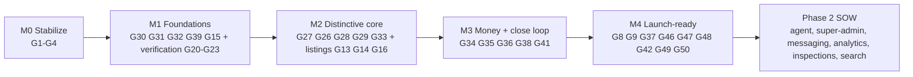

# 05 — Strategic Recommendations & Proposed Phasing

**SafeBuyRealties · Strategic Definition Engagement · Phase 5 of 5 (final)**
Prepared for: Goodness Olajide (Corne Labs, Technical Lead)
Prepared by: Senior Product Architect
Date: 2026-05-23

---

## 0. Purpose & the one decision this document supports

This is the **decision document**. It buckets every feature, shows how each bucket lines up
against the **signed LOE** and the **client's demo**, recommends a path, and makes the trade-offs
explicit — so you can make and **defend a scoping decision to the client**.

The single most important thing this analysis surfaces: **the product the client emotionally
expects (their 66-page demo + requirements doc) is materially larger than the product the LOE
commits you to building (₦1.5M / 6–8 weeks).** The current build sits _below even the LOE_ in a
few places (three broken screens) and _far below the demo_ everywhere that matters (no PoA, no
real escrow, no DD purchase flow). Phasing is how you reconcile honour-the-contract, meet-the-
expectation, and protect-the-agency. **You make the final call; this gives you the map.**

References: feature gaps `G#` are defined in `04_GAP_ANALYSIS.md`.

---

## 1. Recommended feature bucketing

Four buckets: **Core MVP** (without it the product isn't _SafeBuyRealties_) · **Launch-Ready**
(needed to put real users + real naira on it) · **Phase 2** (valuable, cleanly extractable) ·
**Future/Optional** (later, adoption-driven). Each row notes the gap IDs and whether it's already
partly built.

### 1.1 Core MVP — the minimum _coherent, distinctive_ product

| Feature area                                                                                   | Gaps               | Note                                     |
| ---------------------------------------------------------------------------------------------- | ------------------ | ---------------------------------------- |
| Stabilize the three broken screens + CI gate                                                   | G1, G2, G3, G4     | quick win; restores pro + staff pipeline |
| Listings: media, specs, status lifecycle (UNDER_OFFER/SOLD), hide-until-verified               | G13, G14, G15, G16 | brings listings to demo parity           |
| Verification workflow fully usable (assign→approve/reject, risk flags, report accept/revision) | G20, G21, G22, G23 | the operational heart                    |
| **DD service catalog + bundles + VAT**                                                         | G27                | priced via platform config               |
| **DD purchase wizard (7-step, resumable)**                                                     | G26                | the demo centerpiece                     |
| **Power of Attorney execution + document integrity (hash/QR/PDF)**                             | G28, G29           | the legal differentiator                 |
| **Two payment intents (DD vs purchase)**                                                       | G33                | the "defining feature"                   |
| **In-platform escrow ledger + payout + refund + reservation**                                  | G34, G35, G36, G38 | closes the loop safely (RD-1)            |
| Foundations: object storage + upload hardening, audit log, platform config                     | G30, G32, G39, G31 | unblock all of the above                 |
| In-app notifications (status/assignment/payment/approval)                                      | G41                | minimal viable comms                     |

> **Why these are "Core":** strip out PoA, the DD wizard, separated payments, and escrow and you
> are left with a generic listing-plus-verification site — not the fraud-prevention, legally-
> defensible platform the client (two lawyers, previously defrauded) is buying. These are the
> features that _are_ SafeBuyRealties.

### 1.2 Launch-Ready — confident go-live with real users

| Feature area                                                                                     | Gaps          |
| ------------------------------------------------------------------------------------------------ | ------------- |
| Manual KYC records + staff review (RD-3)                                                         | G8            |
| Password reset + email verification                                                              | G9            |
| Auth/payment hardening: rate limiting, refresh tokens, webhook replay/freshness, prod mock guard | G46, G47, G37 |
| NDPR: retention/consent/erasure + privacy policy                                                 | G48           |
| Email/SMS notification channels                                                                  | G42           |
| Automated tests for critical flows + pre-launch security audit/pentest                           | G49, G50      |

### 1.3 Phase 2 — valuable, cleanly extractable

| Feature area                                                                             | Gaps         |
| ---------------------------------------------------------------------------------------- | ------------ |
| Agent/Broker role (leads, offers, commission, performance) + agent/pro self-registration | G5, G12      |
| Super Admin role + RBAC/permission config + content/marketplace management               | G6, G11, G45 |
| In-app messaging / case chat + support tickets                                           | G40, G43     |
| Analytics & reporting (seller/agent/admin/business)                                      | G44          |
| Inspection scheduling + professional earnings/fees                                       | G24, G25     |
| Saved searches, saved/liked, advanced server-side search                                 | G17, G18     |

### 1.4 Future / Optional — adoption-driven

| Feature area                                                                            | Gaps                   |
| --------------------------------------------------------------------------------------- | ---------------------- |
| Map-based discovery                                                                     | G19                    |
| 2FA for staff/admin                                                                     | G10                    |
| Flutterwave as alternative gateway (Paystack already covers RD-1)                       | G51                    |
| **Build-phase professional orchestration** (ARCON/COREN/NIQS/CORBON/TOPREC + approvals) | G52                    |
| AI (document verification, fraud indicators), mobile field app                          | (proposal future-tier) |

---

## 2. LOE alignment analysis

**What the LOE commits to** (verbatim scope) and where each lands:

| LOE-committed item                                                          | Bucket       | Status today                               |
| --------------------------------------------------------------------------- | ------------ | ------------------------------------------ |
| Register/manage accounts (all 5 roles)                                      | Core (built) | ✅ buyer/seller; staff/admin seeded        |
| Browse verified listings                                                    | Core (built) | ✅                                         |
| Submit listings + upload docs + track verification                          | Core (built) | ✅ seller side                             |
| Property professional: assigned, upload reports, update task status         | Core         | 🐛 pro dashboard broken (G1); detail works |
| Internal staff: review docs, manage workflow, approve/reject, update status | Core         | 🐛 workflow broken (G2, G3)                |
| Admin: user mgmt, approval/status control, monitoring                       | Core (built) | ✅ narrow                                  |
| Role-based dashboards (Buyer/Seller/Pro/Staff/Admin)                        | Core         | 🟡 two crash (G1, G2)                      |
| Document upload & verification workflow                                     | Core         | 🟡 needs G20–G23 + G30/G32                 |
| Payment integration (Paystack/Flutterwave)                                  | Core (built) | 🟡 Paystack + mock (G37 hardening)         |
| Transaction tracking                                                        | Core (built) | 🟡 needs payment-intent split (G33)        |
| **Escrow & transaction flow (release on conditions)**                       | Core         | 🔴 needs G34/G35/G38                       |

**Findings:**

- **The LOE is almost entirely "Core MVP."** Honouring the contract = delivering the Core MVP
  bucket (plus a little Launch-Ready hardening). There are **no LOE features that fall outside
  Core** — the LOE _is_ a Core-MVP-shaped commitment.
- **The current build does not yet meet the LOE**, primarily because of (a) the three broken
  role screens (G1–G3) and (b) the unbuilt escrow release flow the LOE explicitly names (G34/
  G35/G38). These must be done to satisfy the signed scope.
- **LOE lets you off some demo hooks:** it names 5 roles (Agent/Broker, Super Admin are demo
  extras → Phase 2); it says "Paystack _or_ Flutterwave" (Paystack satisfies it → Flutterwave is
  Future); messaging, analytics, KYC, inspections are **not** in the LOE.
- **The LOE does NOT name Power of Attorney or the DD service catalog** — yet they are central to
  the client's demo/requirements. This is the crux (see §3, §5).

## 3. Demo alignment analysis

The client's 66-page demo is their expectation anchor. Mapping its surfaces:

**Demo features that ALIGN with LOE → deliver in current engagement (Core MVP):** verified
listings + property detail (with media/specs), role dashboards (buyer/seller/professional/staff/
admin), document upload + verification workflow, status governance (Pending/Verified/Under Offer/
Sold), payment + escrow messaging.

**Demo features OUTSIDE the LOE but CENTRAL to client expectation → the key conversation:**

- **The 7-step DD purchase wizard** and **Power of Attorney execution** (the demo's most
  elaborate, lawyer-authored screens). Not in the LOE, but the client clearly considers them the
  product. _Recommendation: include in Core MVP and have the scope/commercial conversation._
- **Full 15-service catalog + bundles (Standard/Premium/Elite) + escrow configuration.** Catalog
  - bundles → Core; escrow _configuration UI_ → Phase 2 (Super Admin).

**Demo features OUTSIDE the LOE and extractable → Phase 2 conversation:** the 31-page admin/
super-admin suite (people management, RBAC, content, billing, integrations), Agent/Broker
workspace, internal chat/messaging, analytics/business-analytics dashboards, support/escalations,
inspection scheduling, saved/advanced search.

> **The honest message to the client:** "Your demo shows the _complete vision_. The signed LOE
> covers the _core transaction engine_. We will deliver that core — including the Power of
> Attorney and escrow flow that make it trustworthy — to a launchable standard, and we've mapped
> the rest (the full admin suite, agent tools, messaging, analytics) as a clearly-priced next
> phase." This both honours the contract and respects the expectation the demo set.

---

## 4. Recommended path forward

**Recommend: Option B — "Trustworthy Core, then harden, then expand" — delivered in four
sequenced milestones, paired with a scope/commercial conversation with the client up front.**

**Rationale.**

1. **M0 first, always.** ~3–4 days to turn three dead screens into a working pipeline and install
   the CI gate that prevents the next regression. Highest leverage on the board; also the fastest
   way to make the build demoable again.
2. **Foundations before features (M1).** Object storage, audit log, platform config, and the
   status lifecycle unblock everything trust-related and prevent expensive rework. Finish the
   verification workflow here so staff/professionals can actually operate.
3. **Distinctive core (M2) is non-negotiable for _this_ client.** PoA + DD wizard + service
   catalog + separated payments are what differentiate SafeBuyRealties from a listing site and
   what the client's lawyers will look for first.
4. **Close the money loop safely (M3)** with the in-platform escrow ledger + payout/refund +
   reservation — satisfying both the LOE's named escrow flow and the demo's escrow promise.
5. **Don't launch on real users without M4.** KYC, NDPR, hardening, tests, and a pentest are the
   difference between "demo" and "people transact millions of naira" — and the client's legal
   comments explicitly demand the security review.
6. **Everything else is a clean Phase 2 SOW** — extractable without architectural debt, and a
   legitimate revenue opportunity rather than scope creep absorbed at a loss.

**Why not Option A (LOE-literal, skip PoA/escrow-ledger):** it technically defends the contract
but ships the client a thin listing+verification tool that looks nothing like their demo — to a
client _who was already burned by a developer who delivered a buggy, unusable product._ The
reputational risk outweighs the short-term saving.

**Why not Option C (full north-star now):** it's a multi-month, multi-developer programme that
neither the LOE budget nor a single-lead-dev capacity supports; attempting it risks half-built
everything and timeline collapse.

---

## 5. Trade-offs & decision points for Goodness

| #   | Decision                          | Options                                                    | Recommendation                                                                                                                                                                                                                                        |
| --- | --------------------------------- | ---------------------------------------------------------- | ----------------------------------------------------------------------------------------------------------------------------------------------------------------------------------------------------------------------------------------------------- |
| D1  | **Scope envelope**                | A LOE-literal · **B Trustworthy Core** · C Full vision     | **B** — the only option that both honours the LOE _and_ meets the demo expectation for a launchable product                                                                                                                                           |
| D2  | **Commercial reconciliation**     | Absorb extra scope · Change-request now · Phase-2 SOW      | B exceeds the ₦1.5M LOE (and even the ₦2.8M proposal in total scope). **Re-baseline commercials**: deliver LOE-Core, bill PoA/escrow depth as agreed extras, and quote Phase 2 separately. The legal-comments doc already anticipates change-requests |
| D3  | **PoA + escrow legal/regulatory** | Build & self-certify · **Build with legal review** · Defer | **Build with a lawyer-reviewed PoA instrument and an explicit, legally-vetted escrow fund-release model**; budget legal review. This is the highest-risk area and the client _are_ lawyers                                                            |
| D4  | **Escrow money-movement**         | In-platform ledger via Paystack (RD-1)                     | Confirmed RD-1. Ensure a controlled settlement account + reconciliation; mind CBN/AML                                                                                                                                                                 |
| D5  | **Capacity**                      | Single lead dev · Add a developer for M2/M3                | The L/XL items (PoA, escrow, wizard, tests) are the schedule risk. **Adding a second developer for M2–M3** roughly halves the calendar on the critical path                                                                                           |
| D6  | **Quality gate**                  | Ship fast · Tests + pentest before launch                  | **Hold the line on M4** before real users; it's cheap insurance against repeating the client's prior trauma                                                                                                                                           |

---

## 6. Estimated timeline per option

Single focused lead developer, sequential, **±30%**, excluding design iteration and client review
latency. (A second developer on the critical path materially compresses Options B/C.)

| Option                                 | Scope                                                                                         | Est. calendar (1 dev)                                     | With 2 devs on M2–M3 |
| -------------------------------------- | --------------------------------------------------------------------------------------------- | --------------------------------------------------------- | -------------------- |
| **A — LOE-literal**                    | M0 + listings/verification completion + basic payment + minimal escrow flag + light hardening | **~5–7 weeks**                                            | ~4–5 weeks           |
| **B — Trustworthy Core (recommended)** | M0+M1+M2+M3 (Core MVP) then M4 (Launch-Ready)                                                 | **Core ~10–14 wks; +Launch-Ready ~4–6 wks ≈ 14–20 weeks** | ~10–13 weeks         |
| **C — Full north-star**                | B + all Phase 2 + select Future (incl. G52 build-phase)                                       | **~6–9 months**                                           | ~4–6 months          |

Milestone breakdown for B (1 dev): M0 ~0.5–1 wk · M1 ~3–4 wks · M2 ~4–6 wks · M3 ~3–4 wks · M4
~4–6 wks. **Note:** the LOE's 6–8 week expectation aligns only with **Option A**; Option B — the
product the demo promises — needs roughly **2–3× the LOE timeline**, which is the heart of the
commercial conversation.

---

## 7. Risks per option

| Option                   | Principal risks                                                                                                                                                                                                                                                                     |
| ------------------------ | ----------------------------------------------------------------------------------------------------------------------------------------------------------------------------------------------------------------------------------------------------------------------------------- |
| **A — LOE-literal**      | **Client rejection / reputational damage** (delivers nothing like their demo to an already-burned, lawyer-led client); strong likelihood of a contentious "this isn't what we expected" conversation; the LOE's own "escrow flow" still requires real work, so even A isn't trivial |
| **B — Trustworthy Core** | **Commercial overrun vs LOE** (needs re-baselining — D2); **escrow/PoA legal-regulatory exposure** (D3/D4, CBN/AML); **timeline ~2–3× LOE** (manage with D5); requires disciplined "no Phase-2 features leak into Core"                                                             |
| **C — Full north-star**  | **Timeline & cash-flow risk** (months of work against milestone payments); **single-dev bus factor**; **scope-creep / half-built-everything** if not strictly sequenced; build-phase pros (G52) is its own product                                                                  |

**Cross-cutting risks regardless of option** (from `04`): no-tests/no-CI regressions (mitigate
with M0's G4 + M4's G49), document-integrity/security on a fraud platform (M1 foundations + M4
pentest), and the demo-expectation gap (manage proactively with the §3 message and by reusing the
demo's visual language).

---

## 8. Summary recommendation (one paragraph for the client conversation)

> Deliver **Option B**: stabilise the build immediately (M0), lay the trust foundations (M1),
> build the distinctive core the demo promises — **Power of Attorney, due-diligence purchase
> flow, separated payments, and a real escrow ledger with payouts** (M2–M3) — then harden it for
> real users with **KYC, NDPR, testing and a pre-launch security review** (M4). Treat the full
> admin/super-admin suite, agent tools, messaging, analytics, and inspection scheduling as a
> clearly-priced **Phase 2**. Because B is roughly **2–3× the LOE's time and cost**, pair it with
> an upfront, honest scope-and-commercials conversation: _"We'll deliver the trustworthy core your
> demo is built around, to a launchable standard, and we've mapped and priced the rest as a next
> phase."_ This honours the contract, meets the expectation the demo set, protects the agency
> commercially, and — most importantly for a client who was burned before — ships something that
> actually works and inspires trust.

---

## 9. Engagement close

This completes the five-phase strategic definition:

1. `01_SOURCE_SYNTHESIS.md` — every source consolidated; master feature inventory + conflicts.
2. `02_MASTER_PRD.md` — the complete north-star product (conflicts resolved; RD-1/2/3 confirmed).
3. `03_CURRENT_STATE_AUDIT.md` — honest implemented/partial/broken/missing reality.
4. `04_GAP_ANALYSIS.md` — 52 categorized, sized, sequenced gaps with dependencies and risks.
5. `05_STRATEGIC_RECOMMENDATIONS.md` (this) — bucketing, LOE/demo alignment, recommended path,
   trade-offs, timelines, and risks.

**Goodness's decision (D1–D6) sets the scope.** Once chosen, the natural next step — outside this
engagement — is to convert the selected bucket(s) into a sprint-based execution plan (milestones
M0–M4 are already sequenced for Option B) and begin the build, starting with the M0 stabilization
quick win.

> **Strategic definition engagement complete — awaiting Goodness's scoping decision.**
