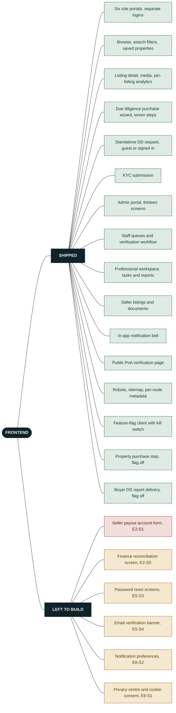
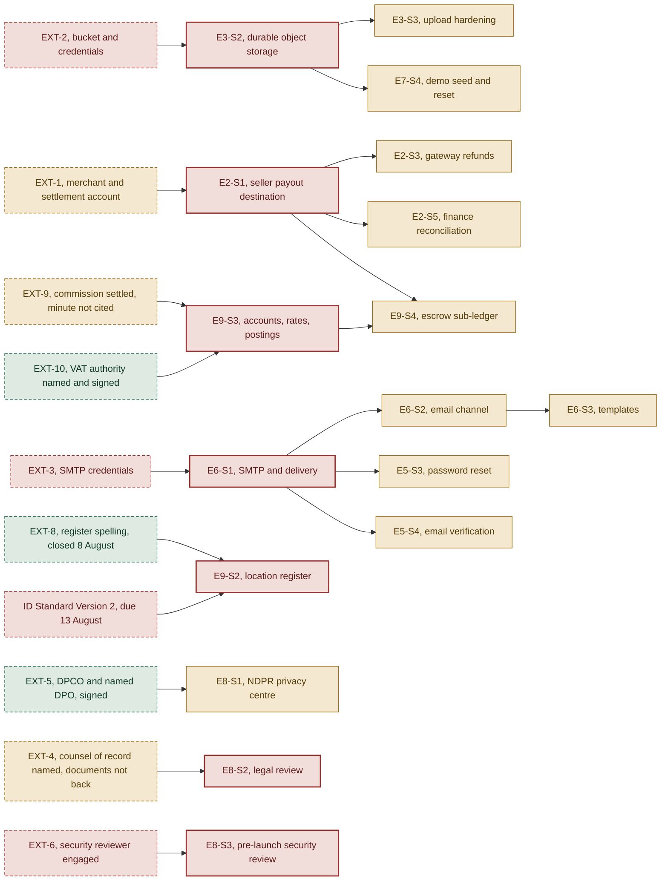

# What is built, and what is owed

SafeBuyRealties build state. Revised 8 August 2026, after four further answers arrived in
conversation rather than on the form. Counts read from `docs/MVP_OUTSTANDING_BACKLOG.md` section 3
and the audit corrections in `docs/BUILD_CHECKLIST.md`. Route, module and coupling counts read from
the working tree at commit `88cbf5c`.

> **This is the permanent copy.** The same content is published as a page, and the page is generated
> from `docs/reports/build-state.html` in this repository, so the two cannot drift. This markdown
> file is the one to correct by hand: GitHub renders the mermaid diagrams below in the browser, and
> a pull request shows exactly which line of a diagram changed. Opening the HTML file straight off
> disk shows the diagrams as plain text rather than pictures, because drawing them needs a script
> the page is not allowed to fetch. That is why both files carry them.

| Count | What it counts |
| --- | --- |
| 42 | Stories on the board |
| 25 | Merged |
| 10 | Planned |
| 7 | Blocked |
| 37 to 59 | Developer-days budgeted |
| +10 to 15 | Cutover, unbudgeted |

---

## What changed on 8 August

Four further answers came back, in conversation rather than on the form, against EXT-4, EXT-8 and
EXT-9. **One external item closed, two dependency columns moved, and no story became startable.**
That is the whole of the movement, and it is worth stating plainly rather than dressing up: the
board's blocked list is the same length this evening as it was this morning.

EXT-8 closed on one sentence. EXT-4 gained counsel of record and its row stayed open, because naming
counsel is not counsel having ruled. EXT-9 is now one line short of closing, and the line it is short
of is a citation. `#153` merged first, carrying the second return into the record and making this page
permanent. `#154` merged after it and wrote the four answers into the register, the board and this
page, so the commit these counts are read from is now `88cbf5c`. Neither pull request moved a count
on this page, which is the finding rather than an omission.

The day before, three pull requests merged and the totals moved for the first time in a week. `#150`
put one fail-closed definition of the runtime environment into the backend, `#151` lit the backend up
in the linter for the first time, and `#152` recorded the dispatched closure schedule. `ADR-0006`
landed with them, which answers decision D4 by removing the question rather than by meeting it, so
E3-S2 now waits on a purchase and not on anybody's judgement.

Then the twelve outstanding items came back filled in, first at 18:16 and again at 23:09.
**Thirty-eight of the sixty-seven points are answered and six of the nine signature blocks are
complete**, and those two counts are identical in both returns and unchanged by the answers that
followed on 8 August, because those four answered points that already carried an answer. **Four of
the twelve items are now closed rather than three.** Only one of the four ever moved a story off the
blocked list, and that was EXT-5 on 7 August. Five items came back entirely blank in both returns,
and the board has held those pending cost implications.

---

## The frontend

64 route files in `src/routes`, six role portals.

Every screen the product sells is already there. What is missing is six screens, and every one of
the six waits on a backend capability that has not been built yet.

Green is shipped, amber is planned and waiting on an upstream story, red is blocked on an outside
input.



---

## The backend

33 Nest modules in `backend/src`, 67 test suites, linted since `#151`.

The trust layer, the authorization layer and the operability layer are done. The gaps are all in the
same place: money leaving the platform, files surviving a deploy, and email leaving the building.

```mermaid
flowchart LR
  BE(["BACKEND"])
  BE --- SH2["SHIPPED"]
  BE --- RE2["LEFT TO BUILD"]

  SH2 --- C1["Auth and six-role identity"]
  SH2 --- C2["PermissionsGuard on every privileged route"]
  SH2 --- C3["Rate limiting, lockout, CORS allow-list"]
  SH2 --- C4["Session refresh rotation and revocation, flag off"]
  SH2 --- C5["Listing lifecycle across ten statuses"]
  SH2 --- C6["Verification workflow, reports, risk flags"]
  SH2 --- C7["Service catalogue, bundles, VAT"]
  SH2 --- C8["DD case lifecycle, queue to completion, flag off"]
  SH2 --- C9["Transaction state machine, flag off"]
  SH2 --- C10["Standalone due diligence, end to end"]
  SH2 --- C11["PoA: PDF, SHA-256, QR, immutable record"]
  SH2 --- C12["Escrow ledger: hold, release, refund, payout row"]
  SH2 --- C13["Webhook idempotency and replay guard"]
  SH2 --- C14["Production guard on payment mock mode"]
  SH2 --- C15["Authorized document access, no static route"]
  SH2 --- C16["KYC records and money-moving gate, flag off"]
  SH2 --- C17["In-app notifications"]
  SH2 --- C18["Audit log, SBR IDs, platform config, maintenance"]
  SH2 --- C19["Health probes, structured logging, correlation id"]
  SH2 --- C20["Financial governance tables, flag off"]
  SH2 --- C21["One fail-closed runtime environment, E7-S7"]

  RE2 --- D1["Seller payout destination and recipients, E2-S1"]
  RE2 --- D2["Gateway refunds, not ledger-only, E2-S3"]
  RE2 --- D3["Reconciliation endpoint, E2-S5"]
  RE2 --- D4["Durable object storage, E3-S2"]
  RE2 --- D5["Upload hardening, magic bytes, AV hook, E3-S3"]
  RE2 --- D6["Password reset tokens, E5-S3"]
  RE2 --- D7["Email verification tokens, E5-S4"]
  RE2 --- D8["SMTP and delivery observability, E6-S1"]
  RE2 --- D9["Email channel per notification type, E6-S2"]
  RE2 --- D10["Transactional email templates, E6-S3"]
  RE2 --- D11["Deterministic demo seed and reset, E7-S4"]
  RE2 --- D12["Consent, retention, erasure, export, E8-S1"]
  RE2 --- D13["Location register and property ID issuance, E9-S2"]
  RE2 --- D14["Accounts, sub-codes, rates, postings, E9-S3"]
  RE2 --- D15["Escrow sub-ledger and reconciliation, E9-S4"]

  classDef spine fill:#10222a,stroke:#10222a,color:#f1f5f3,font-weight:bold
  classDef done fill:#dfeae3,stroke:#1f6b4f,color:#123a2b
  classDef todo fill:#f4e8d1,stroke:#96690f,color:#553c08
  classDef blocked fill:#f1dedb,stroke:#97302c,color:#5c1b18

  class BE,SH2,RE2 spine
  class C1,C2,C3,C4,C5,C6,C7,C8,C9,C10,C11,C12,C13,C14,C15,C16,C17,C18,C19,C20,C21 done
  class D2,D3,D5,D6,D7,D9,D10,D11,D12,D15 todo
  class D1,D4,D8,D13,D14 blocked
```



---

## Progress by epic

| Epic | What it covers | Merged of total |
| --- | --- | --- |
| E1, Close the loop | Buyer journey | 4 of 4 |
| E2, Money integrity | Payouts, refunds, finance | 2 of 5 |
| E3, Document trust | Access and durability | 2 of 4 |
| E4, Access correctness | Privileges and KYC gate | 3 of 3 |
| E5, Account security | Sessions, reset, verification | 4 of 6 |
| E6, Communications | Email leaves the building | 0 of 3 |
| E7, Operability | CI, probes, logging, seed | 8 of 9 |
| E8, Go-live compliance | NDPR, legal, security review | 1 of 4 |
| E9, Financial governance | Coded, ring-fenced, reconcilable | 1 of 4 |

---

## What came back, and what came back after it

Source: `docs/reports/what-is-neededv2.pdf`, returned 7 August 2026 at 23:09, plus four answers given
in conversation on 8 August 2026. The full record of every question and every answer is in
`docs/reports/what-is-needed.md`, where the later four are printed under the point they answer and
marked as having arrived off the form.

The twelve outstanding items were sent out as a form with a typing box against every point and a
signature block on every item. Thirty-eight of the sixty-seven points came back filled in and six of
the nine signature blocks are complete. That sounds better than it is. A filled box is not the same
as a closed item, and on this page four items are genuinely closed, only one of which ever held a
story.

Two returns arrived on 7 August, five hours apart. The second one does not answer a single new point
and it does not add a signature, so every count below is the same in both. It rewrites six answers,
and two of those rewrites are the difference between an item that closes and an item that does not.
**EXT-10 now names a statute where it previously wrote the words "statutory authority", and EXT-8
writes out the register format in full where it previously wrote "Confirmed".** Reading only the
first return would have understated the evening by one closed item and one resolved contradiction.

Four more answers followed on 8 August, in conversation. They carry no name, no role and no
signature, which is a record-keeping problem rather than a substance problem: an answer that never
reaches the form is an answer the next reader of the form cannot see. Their substance is real all the
same. **EXT-8 closed on them, EXT-4 point 7 closed on them and the EXT-4 row did not, and EXT-9 came
within one line of closing.**

| Count | What it counts |
| --- | --- |
| 38 of 67 | Points answered |
| 6 of 9 | Signature blocks complete |
| 4 | Items closed outright |
| 3 | Answered, not closing |
| 5 | Returned blank |

| Item | Points | Signed by | State | What it does to the story it holds |
| --- | --- | --- | --- | --- |
| EXT-5 | 9 of 9 | Barr. Isoken Adisa-Isikalu, CLO | **Closes** | The one real close. A named Data Protection Officer with an address, Goldrush Partners as the compliance organisation, the commencement date, the retention basis and the GAID copy. E8-S1 has its inputs. One conflict to carry into the build: the answer allows erasure only after six years, which is not what the right to erasure says. |
| D3 | 3 of 3 | Abiodun Olaluwe, CTO | **Closes** | Closes, but holds no story. Manual review for the first release, no provider, signed. E4-S2 already shipped on manual review. One loose thread: the box names Goodness Ifejesu Olajide as the decider and the signature block on the same item is the Chief Technology Officer. |
| EXT-10 | 1 of 1 | Barr. Isoken Adisa-Isikalu, CLO | **Closes** | Closed by the second return. The first wrote "STATUTORY AUTHORITY", which is the phrase the ask was trying to replace. The second names the Nigeria Tax Act 2025 and links the published copy. It also closes point 6 of EXT-4, because the two ask the same question. Two reservations: no section is cited inside the Act, and the signature is the in-house Chief Legal Officer where the ask named the instructed firm. |
| EXT-8 | 4 of 4 | Adebiyi Emmanuel Babatope, COO | **Closes** | Closed on 8 August by one sentence: SVR is the code for a Surveyor and SUR is the code for Surulere. That disposes of the last contradiction by saying what SUR is instead of choosing between two readings of it. It releases no story. E9-S2 drops EXT-8 from its dependency list and is then held by version 2 of the identifier standard, due 13 August 2026. The closing sentence arrived in conversation, so it carries no name and no role against it. |
| EXT-1 | 7 of 7 | Olufemi Adisa-Isikalu, CEO | Answered | Every point answered, nothing delivered. The keys are still to be generated and the settlement account number is "ready on Monday". The second return replaces the refusal at point 3 with the Corporate Affairs Commission registration, which proves the company exists and does not say that money sitting in its account belongs to somebody else. That is the thing E2-S1 needs. |
| EXT-4 | 11 of 11 | Idris Aregbe, CFO, attested by the CLO | Answered | Counsel of record was named on 8 August: Barr. Isoken Adisa-Isikalu, Chief Legal Officer. That closes point 7, because the attestation already on the form is now counsel's own ratification rather than a second finance signature, and it retires the reservation carried over from EXT-10 about an in-house officer signing where the ask named an instructed firm. The row stays open. Naming counsel is not counsel having ruled, none of the three EXT-4 documents has come back confirmed, and four of the eleven points still answer a different question from the one asked. |
| EXT-9 | 3 of 3 | Idris Aregbe, CFO | Answered | Commission is two-sided, with a hard floor of 10 percent combined and a configurable actual rate, and the worked example runs to the end. The 8 August answers settle the override: a per-transaction variation needs the CEO, the Chief Legal Officer and the Chief Operating Officer, all three together and not any one of them, it is not capped upward, and every variation is recorded against the transaction with the approver's identity. One line is still owed. The answer points at a minute recorded in the late hours of 7 August 2026 WAT and a date is not a reference. E9-S3's commission rate row is not seeded until that line comes back. |
| EXT-2 | 0 of 7 | Not required | Blank | A purchase. E3-S2's verification half stays blocked. The code half does not need it. |
| EXT-3 | 0 of 9 | Not required | Blank | A purchase. E6-S1 and the four stories behind it stay blocked. The single most expensive blank on the page, measured in stories held. |
| EXT-6 | 0 of 8 | Blank | Blank | A purchase. E8-S3 stays blocked, and this one has a lead time, so a start date would have been worth more than nothing. |
| ADR-0004 | 0 of 4 | Blank | Blank | Costs nothing. A ratification of a decision already written down, and it is the record E3-S2 and E3-S3 are built against. |
| ADR-0006 | 0 of 1 | Blank | Blank | Costs nothing. One officer's name accepting the move off Vercel. Everything in the cutover section rests on a decision still marked Proposed with nobody's name against it. |

**The cost hold explains three of the five blanks, not five.** EXT-2, EXT-3 and EXT-6 are purchases
and the board is right to want a number before committing to them. ADR-0004 and ADR-0006 are
signatures against decisions that have already been written. They carry no invoice, they hold work
all the same, and they are the cheapest things anybody could return tomorrow.

**One name conflict closed, one spelling conflict still open.** The Chief Operating Officer now
reads Adebiyi Emmanuel Babatope everywhere he appears. The domain does not: the company is
`safebuyrealtiesltd` at EXT-5 point 1 and `safebuyrealitiesltd.com` at EXT-4 points 1 and 10. That
second value is the target every Power of Attorney QR code prints onto paper. One of the two is
wrong and it needs settling before the next instrument is issued. Neither the second return nor the
8 August answers touched either point, so the conflict is a day older and no nearer settled.

**One answer asks for work rather than closing it.** EXT-4's answer on the execution of land
instruments says the baton passes to the appropriate professional services, an offering that can be
searched for and contracted on the application. The application does not offer that today, and this
was checked file by file rather than assumed. The professionals module carries a profile, document
upload and credential verification. The service catalogue carries items, bundles and price
calculation. Every professional-facing route in the frontend is a professional's own dashboard.
There is no route by which a seller searches for a professional, no engagement, no contract and no
fee flow. So the answer describes a capability that has to be built, and it is deliberately left
unsized and off the board until somebody says whether it belongs in the first release. Separately,
the answer names who performs a conveyance and the question was whether a seller's Power of Attorney
can be signed electronically at all. The seller signs before any professional is engaged, so the
narrower question is still open with counsel.

**One consequence of "not capped" belongs with counsel too.** With no upward cap on a commission
variation, three officers acting together can set the seller side above the 10 percent that clause 5
of the Power of Attorney authorises deducting at source. That is not a reason to refuse the answer.
It is a reason to put the conflict in front of the Chief Legal Officer before the first variation is
approved rather than after.

**Three readings still disagree with what is already written down.** EXT-1 point 4 calls the escrow
account a "revenue flow account", where `ADR-0002` records escrow principal as a client-funds
liability and never as platform revenue. EXT-1 point 6 confirms daily reconciliation of inflows,
where section 11.1 of the same ADR asks for the escrow bank balance reconciled against the sum of
the per-transaction sub-ledgers, which is a different check and the one that catches a shortfall.
And EXT-5 point 5 allows erasure only after six years, which is not what an erasure right is. None
of the three blocks a story. All three are cheaper to settle now, in a sentence each, than after the
code is written against them.

---

## What actually holds the sixteen

Sixteen of the seventeen remaining stories sit behind a row that is waiting on an answer, an account
or a signature from outside the repository. The seventeenth is E8-S1, released on 7 August when
EXT-5 came back signed, and it is the largest single story left on the board. Unblock four of the
seven heads and thirteen more stories follow.

One of the nine gates went away on 7 August rather than being answered. `D4` asked which of the
three lawful transfer conditions the running host sits under, and `ADR-0006` put the bucket in a
Nigerian region, so nothing is transferred and the question has nothing left to bite on. **E3-S2 is
the only head on this graph now held by a purchase order rather than by a judgement.**

Two of the boxes have gone green since without releasing anything behind them, and the reason is the
same in both cases. **A gate with two inputs opens when both of them open.** EXT-10 is answered and
signed, but E9-S3 sits behind EXT-9 as well, and EXT-9 has still not cited the minute the commission
rate is recorded in. EXT-8 closed on 8 August, but E9-S2 sits behind version 2 of the identifier
standard as well, and that is due on 13 August 2026. Closing an input is worth doing on its own
terms. It is not the same as starting a story.

Dashed boxes are outside inputs. Green is answered and signed, or closed. Amber means something came
back and nothing closed. Red means nothing came back.



**Three of the seven have a buildable code half today.** E3-S2 needs the bucket for verification,
not for the driver: the storage abstraction, the key scheme and the migration path can be written
now that the hosting target is Nigerian infrastructure in a Nigerian region. E6-S1 can be built
against a stubbed transport and pointed at a real one when EXT-3 lands. E2-S1's model, encryption
and blocked-payout path do not need a live merchant account, only the flow that follows them does.

That is the critical path worth working: the hosting cutover guards first, because every other
production guard keys off a platform being left behind, then E3-S2's code half, then E6-S1, then
E3-S3 and the E2-S1 model.

**E8-S1 joins them, and it is not a code half, it is the whole story.** It is the largest single item
on the board, it is the one piece of remaining work that no longer waits on anybody, and nothing that
came back on 8 August changed that either way.

---

## The seventeen, in full

Half refers to which side of the repository the work lands in.

| ID | Story | Half | State | What it waits on |
| --- | --- | --- | --- | --- |
| E2-S1 | Seller payout destination, per-seller bank account | Both | Blocked | EXT-1, a live merchant and settlement account. D2 answered: the platform holds client funds. |
| E3-S2 | Durable object storage in production | Backend | Blocked | EXT-2 alone since 7 August. D4 closed by ADR-0006, which removed the question instead of answering it. |
| E6-S1 | SMTP configuration and delivery observability | Backend | Blocked | EXT-3, SMTP credentials and a verified sending domain. |
| E8-S1 | NDPR consent, retention and erasure | Both | Planned | Released on 7 August. EXT-5 came back answered and signed. Two consent tiers, a RoPA, a DPIA and a SNAG grievance route, plus one wording conflict to put back to the Chief Legal Officer. |
| E8-S2 | Legal review of the PoA instrument and terms | Neither | Blocked | EXT-4. No code. Counsel of record is named as of 8 August and none of the three documents has come back confirmed. The seven-clause instrument in `poa.service.ts` has still never been read by counsel, and the electronic execution question about the seller's Power of Attorney is still open. |
| E8-S3 | Pre-launch security review | Neither | Blocked | EXT-6. No code. An engaged reviewer closes it. |
| E9-S2 | Location register and property ID issuance | Backend | Blocked | EXT-8 closed on 8 August. What is left is version 2 of the identifier standard, due 13 August 2026. |
| E9-S3 | Six main accounts, sub-codes, commission and VAT rates, postings | Backend | Blocked | EXT-10 is answered and the override rule is settled: three named officers together, no upward cap, every variation recorded with the approver's identity. EXT-9 still has not cited the minute the rate is recorded in, so the commission rate row cannot be seeded. |
| E2-S3 | Gateway refunds, not ledger-only | Backend | Planned | E2-S1 |
| E2-S5 | Finance reconciliation view | Both | Planned | E2-S1 |
| E3-S3 | Upload hardening: allow-list, magic bytes, AV hook | Backend | Planned | E3-S2 |
| E5-S3 | Password reset | Both | Planned | E6-S1 |
| E5-S4 | Email verification on self-registration | Both | Planned | E6-S1 |
| E6-S2 | Email channel per notification type | Both | Planned | E6-S1 |
| E6-S3 | Transactional email templates | Backend | Planned | E6-S2 |
| E7-S4 | Deterministic demo seed and reset | Backend | Planned | E3-S2 |
| E9-S4 | Escrow sub-ledger and the section 11.1 reconciliation | Backend | Planned | E9-S3 and E2-S1 |

---

## The eighteenth thing, which is on nobody's board

`ADR-0006` takes the platform off Vercel onto self-managed Nigerian infrastructure. That decision
released D4 and it also bought work, and not one of the forty-two rows above pays for it. 31 files
under `src`, `backend` and `scripts` still name Vercel. The list below is what a search of the
working tree turns up, checked file by file rather than estimated.

| Where | What it does today | What the move costs |
| --- | --- | --- |
| `backend/package.json` | `vercel-build` runs `prisma migrate deploy`, then a seed, then a listing fixup, as a build step. | The one that matters. A schema change reaches production today with no operator between the push and the migration. Off Vercel there is no build hook to carry it, so the release procedure has to be written rather than inherited. |
| `storage.service.ts` | `process.env.VERCEL` picks the upload root at two places. | Goes away with E3-S2, which already owns it. The two are the same edit done once. |
| `cors-config.ts` | Fifteen references, matching `*.vercel.app` preview origins. | Preview origins stop existing in that shape. The allow-list needs a replacement rule before the old one is deleted, not after, or E5-S2a's fix is undone by the cleanup. |
| `runtime-environment.ts` | Reads `VERCEL_ENV` as one of three signals and takes the most hardened. | Deliberately kept. E7-S7 built it to survive exactly this move, and the vendor signal is dropped after the last Vercel deployment is retired, not before. |
| `seo.ts` | `DEFAULT_SITE_URL` is `safebuyrealties-app.vercel.app`. | This is the value a Power of Attorney QR code prints onto paper. Issued instruments cannot be recalled, so this one changes before any further instrument is generated. |
| `paystack.service.ts` | Reads `VERCEL_ENV` when deciding whether mock mode is allowed. | Small, once `runtime-environment.ts` is the single source. A call-site change, not a rule change. |
| `vite.config.ts`, `vercel.mjs` | The nitro vercel preset gated on `VERCEL=1`, plus the `/api/v1` rewrite and the ignoreCommand. | A different build preset and a real reverse proxy in front of the API. Mechanical, but it is where the frontend stops being served by somebody else. |
| seven `vercel-*.mjs` | Migrate, seed-if-empty, ensure-pipeline-listings, two ignore commands, an API smoke test and a Paystack env sync. | Each is either rehomed into the release procedure or deleted. `vercel-seed-if-empty.mjs` was read rather than assumed: it will not wipe a populated database, but it will seed demo users into production once if the demo account is missing. |

This is three rows, not one, and they are not the same kind of work. Decoupling the code from the
vendor is M and it can start today. Writing the release procedure that replaces `vercel-build` is M,
and it is the one that protects production data, because it is the only thing standing between a
pushed migration and a table people are reading from. The move itself is L and is mostly operations
rather than engineering. Together, roughly 10 to 15 developer-days on top of the published 37 to 59.

None of that is written into the backlog yet, and it stays unwritten by instruction. Whether the
cutover counts against the published totals or sits outside them is a decision the board was to take
on 8 August 2026, once the cost implications were in. **That date is today and the answer has not
come back.** Moving a published ceiling is a scoping call rather than housekeeping, so nothing goes
into the three record documents until it does. The estimate above stands and the rows stay unwritten.

---

## What has landed, and what is open

| PR | What it does | Half | State |
| --- | --- | --- | --- |
| `#150` | E7-S7: one fail-closed definition of the runtime environment. Three signals, most hardened wins, unknown treated as production. | Backend | Merged |
| `#151` | Lints the backend, which nothing had ever done. 226 errors cleared, eslint taught that the repository has two halves, a lint job added to CI. | Both | Merged |
| `#152` | The closure schedule dispatched, five answers recorded, ADR-0003 accepted, ADR-0006 written. Documents only. | Neither | Merged |
| `#153` | The second return read into the record, E8-S1 released, and this page written as a permanent file in the repository rather than a published page with no source. Documents only. | Neither | Merged |
| `#154` | The four answers of 8 August written into the record: EXT-8 closed, counsel of record named under EXT-4, EXT-9's three-of-three variation rule settled, two dependency columns moved. Documents only. | Neither | Merged |
| E3-S2a | The code half of durable object storage. Branch cut off `main`, one file written so far: a boot guard that refuses the local storage driver wherever the environment resolves to production. Not wired in, not pushed, no pull request. | Backend | In progress |

The review queue is empty. All five of those pull requests are on `main`. The first four are why the
counts above moved for the first time in a week. `#154` moved no count at all and says so in its own
first paragraph. One branch at a time remains the rule: every pull request
in this repository touches the same three record documents, so a second branch opened alongside
conflicts in exactly those three files.

---

## Notes on the numbers

Twenty-five merged plus ten planned plus seven blocked is forty-two, which is the same number as
there are story headings in the backlog. The two figures were derived separately and they agree.

**Four items closing has moved one story, and that was on 7 August.** EXT-5 released E8-S1 at 18:16
and that is already counted above. EXT-10, D3 and EXT-8 close without releasing anything. E9-S3
still waits on EXT-9, D3 records a decision that E4-S2 had already shipped, and E9-S2 still waits on
version 2 of the identifier standard. So the totals here are unchanged by the second return and
unchanged again by the answers of 8 August, which is the honest reading and not a cautious one.

**Two dependency columns moved on 8 August and nothing else did.** E9-S2 lost EXT-8 and gained a
dated deliverable in its place. E9-S3 lost EXT-10 when that closed on 7 August and still carries
EXT-9. A shorter dependency list is progress worth recording. It is not a story that can be picked
up, and this page does not count it as one.

The 10 to 15 days for the cutover are an estimate made here rather than a figure quoted from the
backlog, because the backlog does not carry the row yet.

## How to keep this page current

1. Edit `docs/reports/build-state.md`, which is this file, for anything a reviewer needs to read in
   a diff. The diagrams live in fenced ` ```mermaid ` blocks and GitHub draws them in the browser.
2. Make the matching edit in `docs/reports/build-state.html`, which is the file that gets published.
   The two mermaid blocks in it are identical to the two above, so a change is a copy across.
3. Publish `docs/reports/build-state.html` again to the same link. The link does not change.

The related record of every outstanding question and every answer given is
`docs/reports/what-is-needed.md`, with the same content as `what-is-needed.html`,
`what-is-needed.docx` and `what-is-needed.pdf`. All four are generated from one source, so correct
the source rather than any single output.
